[MyBatis-Plus文档](https://www.baomidou.com/)

## 快速入门

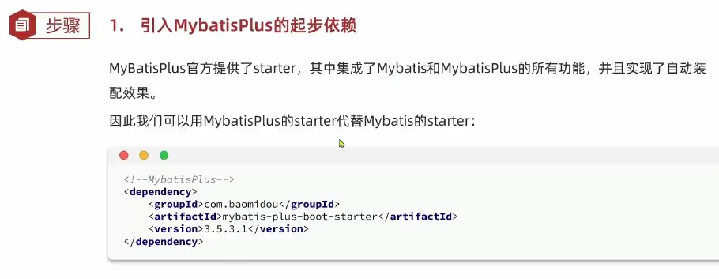

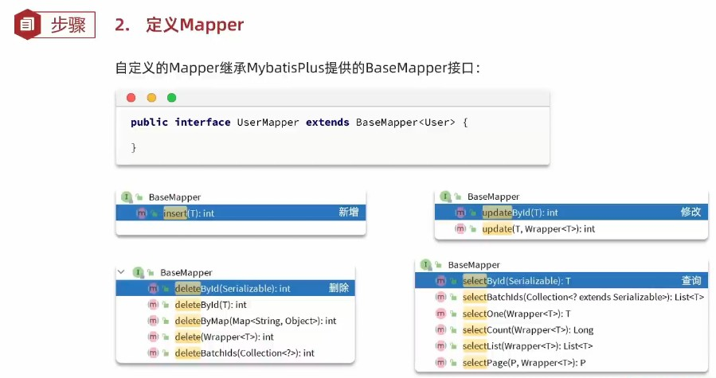

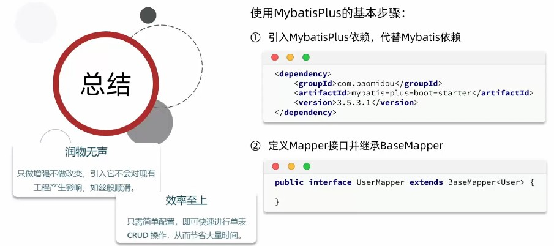

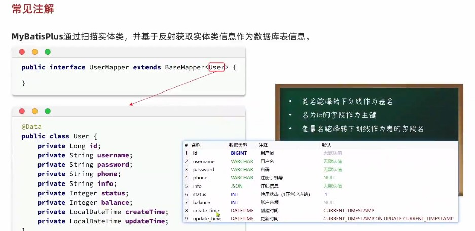

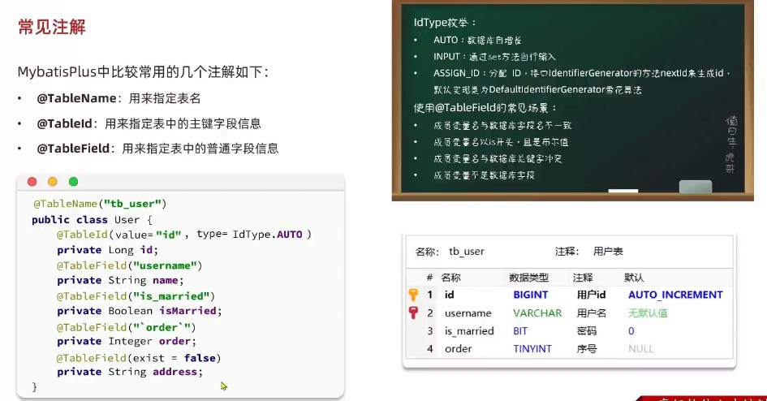

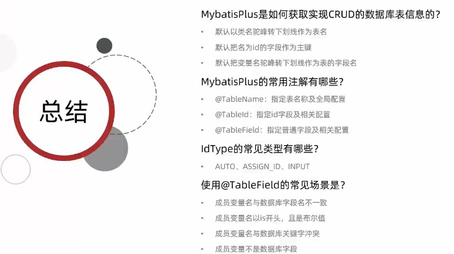

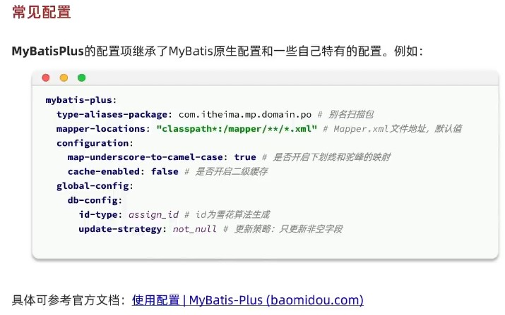

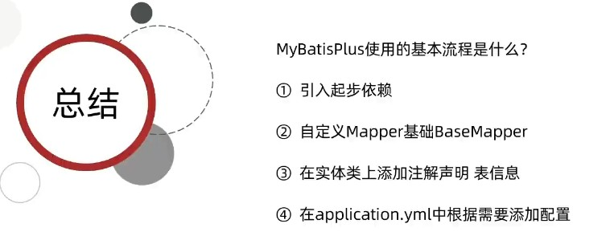

## 核心功能

### 条件构造器

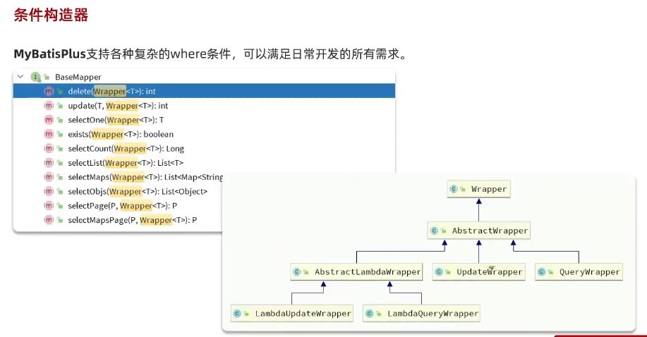

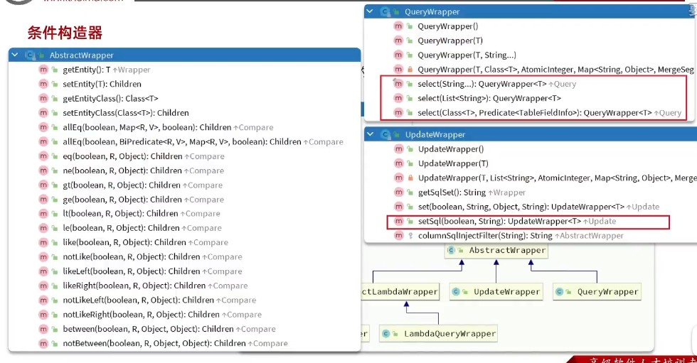

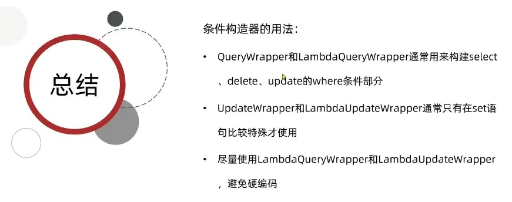

### 自定义SQL

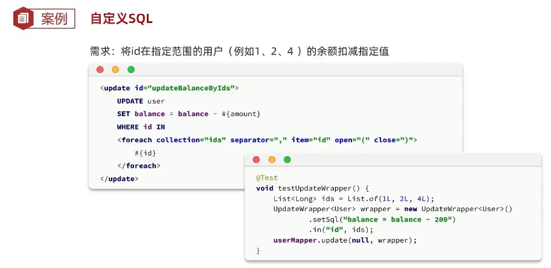

这样直接写会违背开发原则，开发原则要求不要在业务层写SQL，所以使用自定义SQL，将 WHERE 条件的构建交给 MP，剩下的自定义

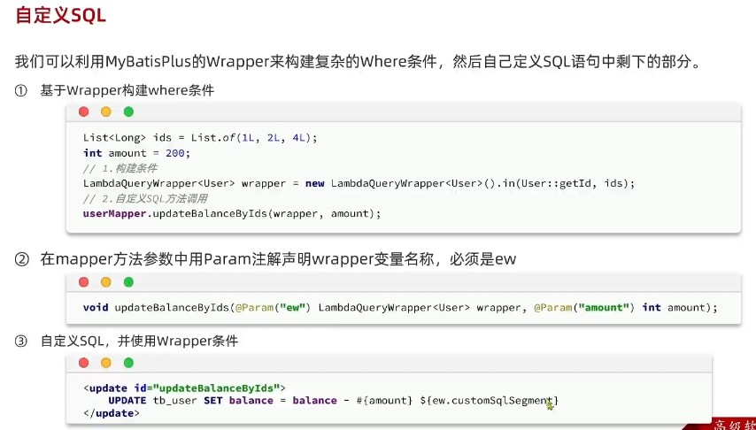

### IService 接口

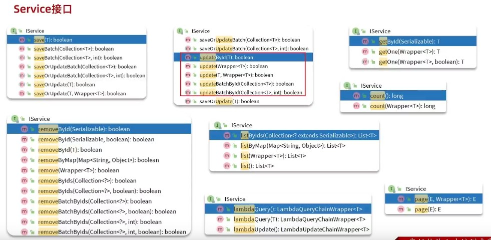

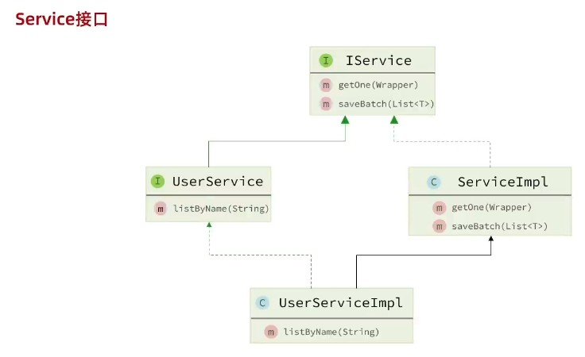

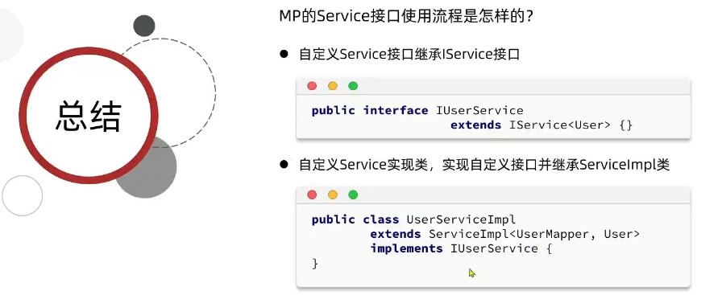

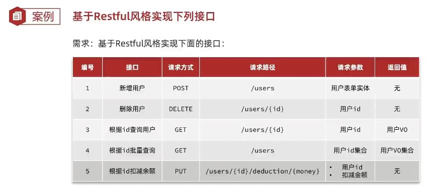

接口1-4就属于简单接口，直接在 controller 即可实现，无需编写任何 service 代码，非常方便

不过，一些带有业务逻辑的接口则需要在service中自定义实现了，如需求5。这看起来是个简单修改功能，只要修改用户余额即可。但这个业务包含一些业务逻辑处理：
- 判断用户状态是否正常
- 判断用户余额是否充足

这些业务逻辑都要在service层来做，另外更新余额需要自定义SQL，要在mapper中来实现。因此，我们除了要编写controller以外，具体的业务还要在service和mapper中编写。

1. IService开发基础业务接口

```java
// 接口1-4
@Api(tags = "用户管理接口")
@RequiredArgsConstructor
@RestController
@RequestMapping("users")
public class UserController {

    private final IUserService userService;

    @PostMapping
    @ApiOperation("新增用户")
    public void saveUser(@RequestBody UserFormDTO userFormDTO){
        // 1.转换DTO为PO
        User user = BeanUtil.copyProperties(userFormDTO, User.class);
        // 2.新增
        userService.save(user);
    }

    @DeleteMapping("/{id}")
    @ApiOperation("删除用户")
    public void removeUserById(@PathVariable("id") Long userId){
        userService.removeById(userId);
    }

    @GetMapping("/{id}")
    @ApiOperation("根据id查询用户")
    public UserVO queryUserById(@PathVariable("id") Long userId){
        // 1.查询用户
        User user = userService.getById(userId);
        // 2.处理vo
        return BeanUtil.copyProperties(user, UserVO.class);
    }

    @GetMapping
    @ApiOperation("根据id集合查询用户")
    public List<UserVO> queryUserByIds(@RequestParam("ids") List<Long> ids){
        // 1.查询用户
        List<User> users = userService.listByIds(ids);
        // 2.处理vo
        return BeanUtil.copyToList(users, UserVO.class);
    }
}
```

2. IService开发复杂业务接口

首先在UserController中定义一个方法：

```java
public class UserController {
    private final IUserService userService;

    @PutMapping("{id}/deduction/{money}")
    @ApiOperation("扣减用户余额")
    public void deductBalance(@PathVariable("id") Long id, @PathVariable("money")Integer money){
        userService.deductBalance(id, money);
    }
}
```

然后是UserService接口：
```java
public interface IUserService extends IService<User> {
    void deductBalance(Long id, Integer money);
}
```

UserServiceImpl实现类：
```java
@Service
public class UserServiceImpl extends ServiceImpl<UserMapper, User> implements IUserService {
    @Override
    public void deductBalance(Long id, Integer money) {
        // 1.查询用户
        User user = getById(id);
        // 2.判断用户状态
        if (user == null || user.getStatus() == 2) {
            throw new RuntimeException("用户状态异常");
        }
        // 3.判断用户余额
        if (user.getBalance() < money) {
            throw new RuntimeException("用户余额不足");
        }
        // 4.扣减余额
        baseMapper.deductMoneyById(id, money);
    }
}
```

最后是mapper：
```java
public interface UserMapper extends BaseMapper<User> {
    @Update("UPDATE user SET balance = balance - #{money} WHERE id = #{id}")
    void deductMoneyById(@Param("id") Long id, @Param("money") Integer money);
}
```

### IService 接口的Lambda查询

1. 复杂查询

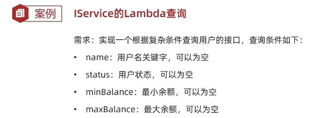

```java
public class UserController {
    private final IUserService userService;

    @GetMapping("/list")
    @ApiOperation("根据id集合查询用户")
    public List<UserVO> queryUsers(UserQuery query){
        // 1.组织条件
        String username = query.getName();
        Integer status = query.getStatus();
        Integer minBalance = query.getMinBalance();
        Integer maxBalance = query.getMaxBalance();
        // 2.查询用户
        List<User> users = userService.lambdaQuery()
                .like(username != null, User::getUsername, username)
                .eq(status != null, User::getStatus, status)
                .ge(minBalance != null, User::getBalance, minBalance)
                .le(maxBalance != null, User::getBalance, maxBalance)
                .list();
        // 3.处理vo
        return BeanUtil.copyToList(users, UserVO.class);
    }
}
```
`lambdaQuery` 方法中除了可以构建条件，还需要在链式编程的最后添加一个`list()`，这是在告诉MP我们的调用结果需要是一个list集合。还可以使用 `one()`：最多1个结果；`list()`：返回集合结果；`count()`：返回计数结果

2. 复杂更新

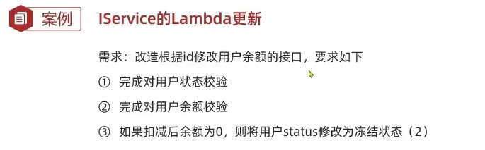

```java
@Service
public class UserServiceImpl extends ServiceImpl<UserMapper, User> implements IUserService {
    @Override
    @Transactional
    public void deductBalance(Long id, Integer money) {
        // 1.查询用户
        User user = getById(id);
        // 2.校验用户状态
        if (user == null || user.getStatus() == 2) {
            throw new RuntimeException("用户状态异常！");
        }
        // 3.校验余额是否充足
        if (user.getBalance() < money) {
            throw new RuntimeException("用户余额不足！");
        }
        // 4.扣减余额 update tb_user set balance = balance - ?
        int remainBalance = user.getBalance() - money;
        lambdaUpdate()
                .set(User::getBalance, remainBalance) // 更新余额
                .set(remainBalance == 0, User::getStatus, 2) // 动态判断，是否更新status
                .eq(User::getId, id)
                .eq(User::getBalance, user.getBalance()) // 乐观锁
                .update();
    }
}
```


## 扩展功能

1. 代码生成

大部分代码都是一样的，只有类名不一样，它跟表名相关，因此可以利用插件（MyBatisPlus）来根据表自动生成代码

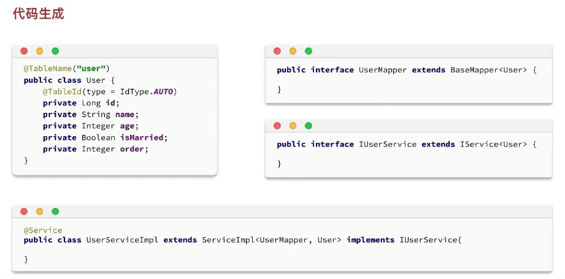

2. 静态工具

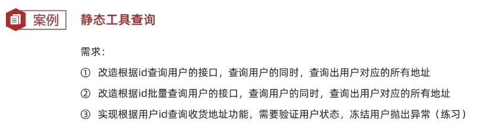

上面的案例中在查询用户的时候需要返回地址，因此 `UserService` 中需要注入 `AddressService` ；在查询地址的时候需要验证用户状态，所以 `AddressService` 中同样需要注入 `UserService` ，出现循环依赖问题

为了解决上述问题，MybatisPlus提供一个静态工具类：Db，其中的一些静态方法与 `IService` 中方法签名基本一致，也可以帮助我们实现CRUD功能：

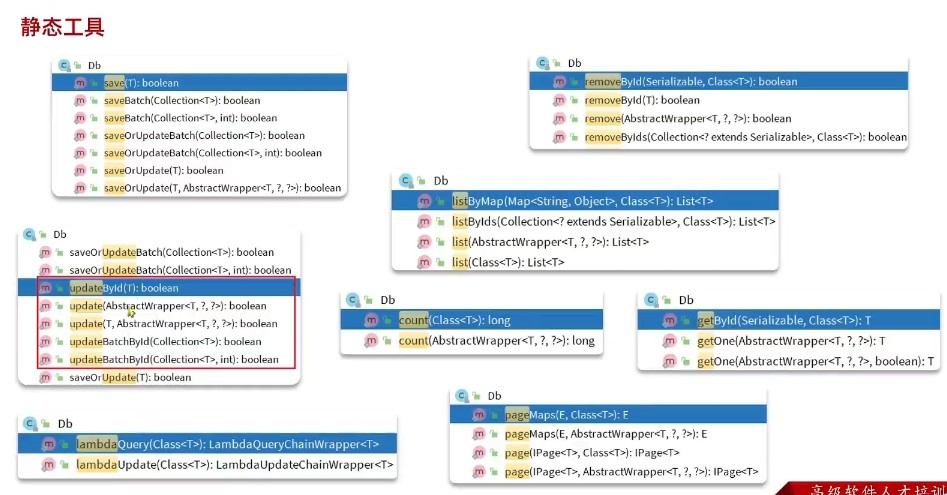

3. 逻辑删除

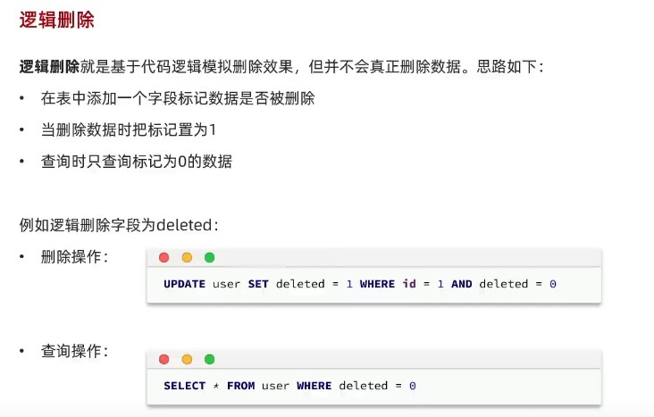

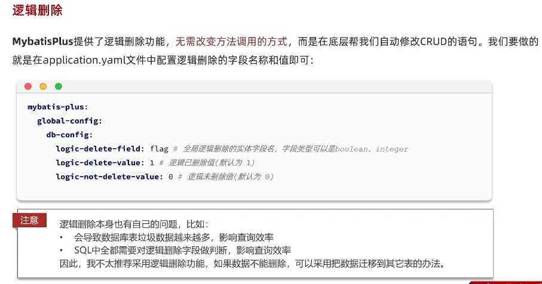

4. 枚举处理器

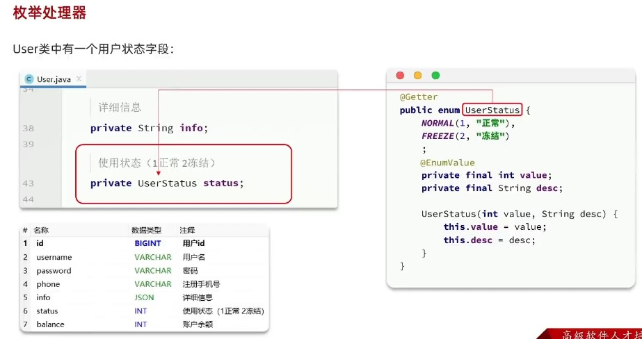

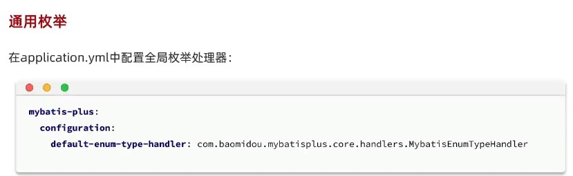

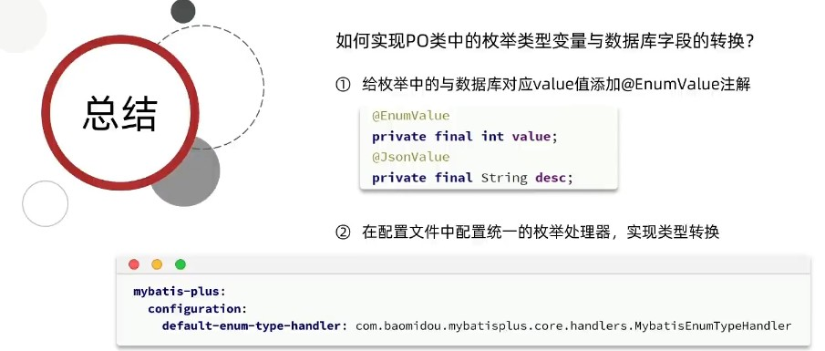

5. JSON处理器

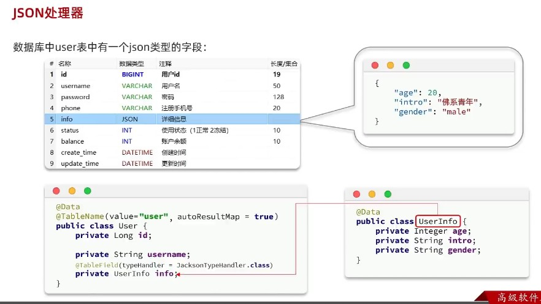

## 插件功能

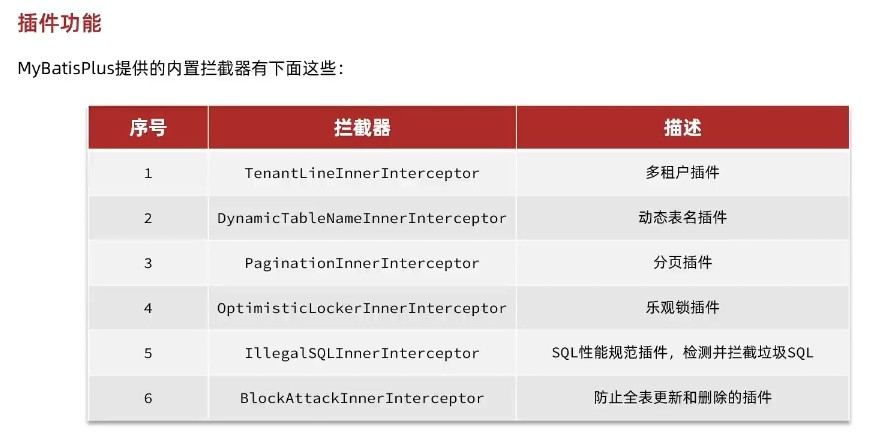

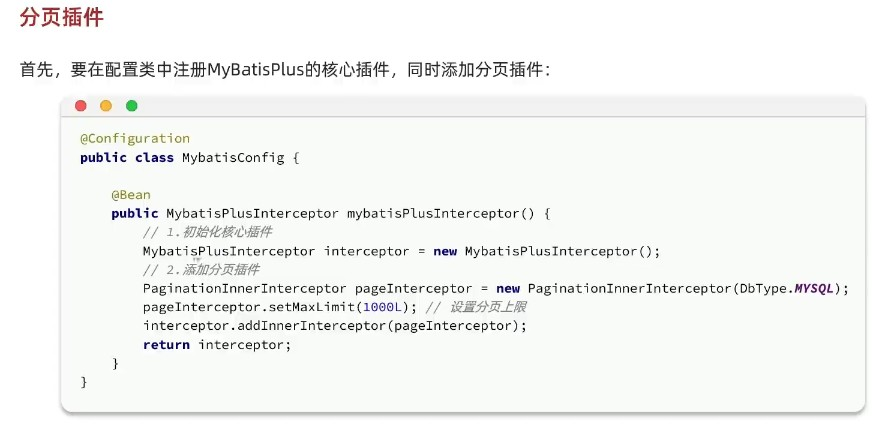

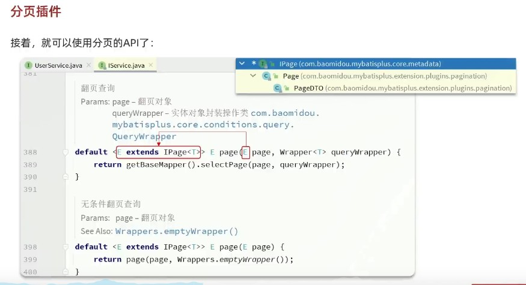

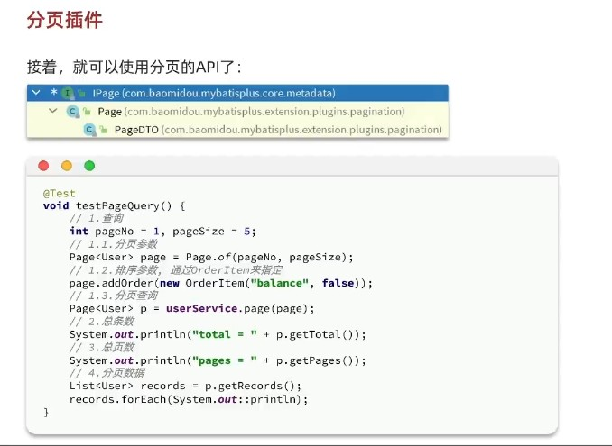
