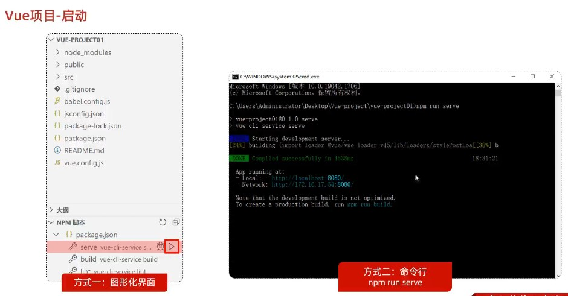
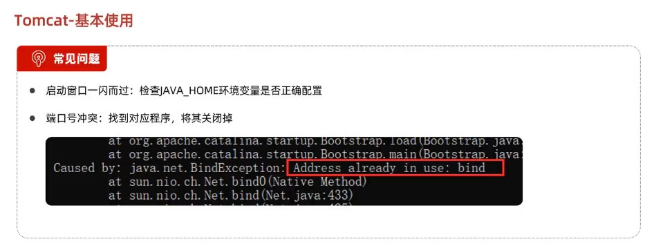
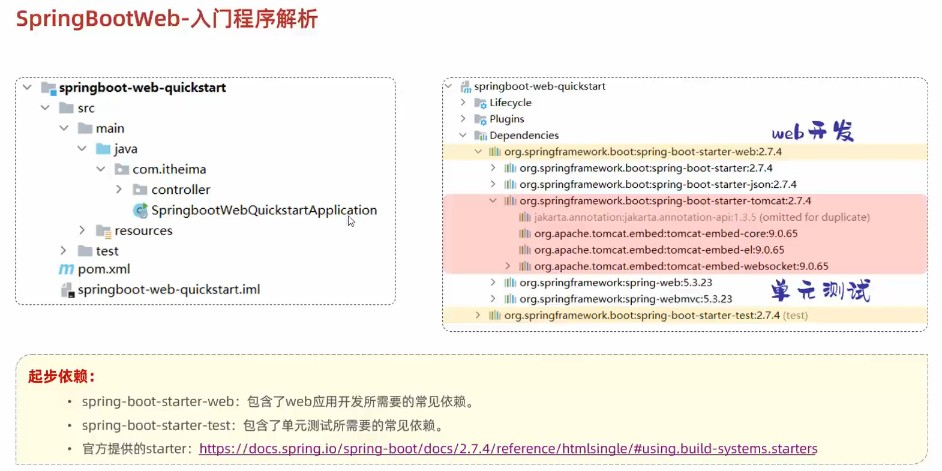
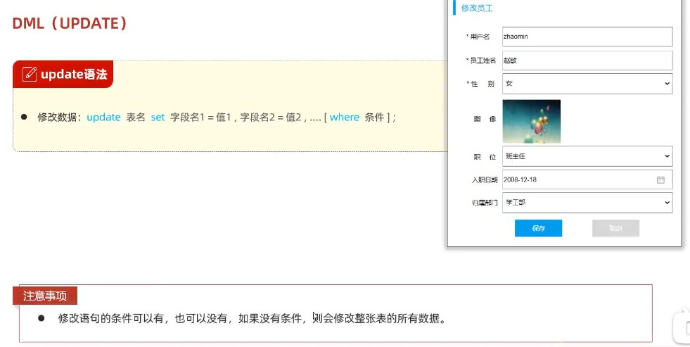
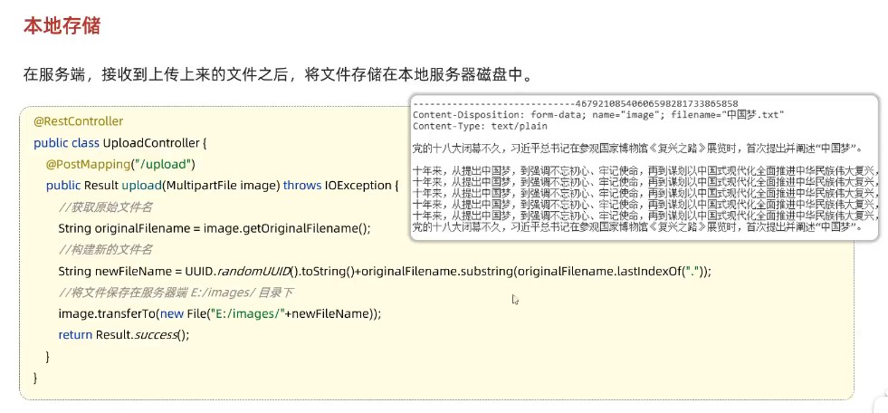
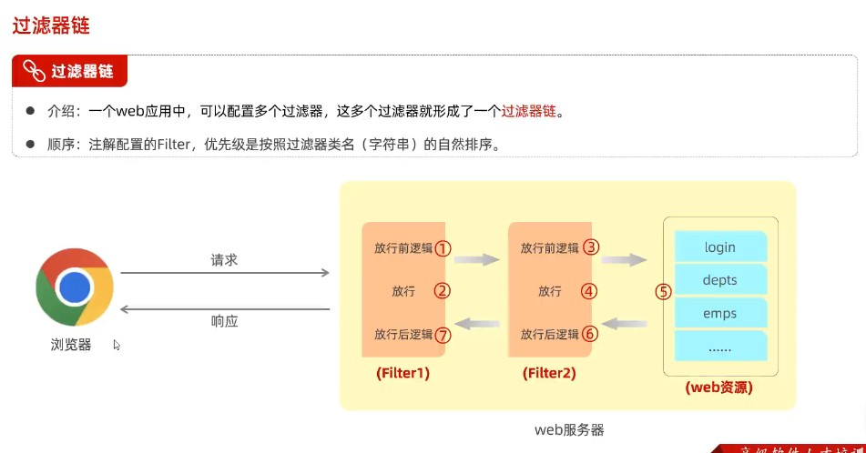

# Web 前端开发

## HTML

id 不能重复, class 可以重复

## JavaScript

var 定义的是全局变量，可重复定义；let 是局部变量，不可重复定义

## Vue

Vue - JavaScript 的高级框架

## Ajax

Ajax - 异步交互技术

## 前端工程化

### Vue 组件库 Element

### Vue 路由

### 打包部署

# Web 后端开发

## maven

## Web 入门

- spring 和 springboot 概述

- HTTP

- Web 服务器 Tomcat

## HTTP 请求和响应

## 分层解耦

## MySQL

- 数据库设计 DDL

- 数据库操作 DML

- 数据库查询 DQL

- 多表设计

- 多表查询

- 事务

- 索引

## Mybatis

- CRUD

- 动态 SQL

## 案例

- 部门管理

- 员工管理

- 文件上传

- 配置文件

- 登陆校验

删除一行 ctrl+y
注释 ctrl+shift+/
格式化 ctrl+alt+l
复制一行 ctrl+d
向下新建一行 shift+enter
向上新建一行 ctrl+alt+enter

