## Java 基础

- **基本数据类型总结**


隐式类型转换
1. 取值范围小的，和取值范围大的进行运算，小的会先提升为大的，再进行运算
2. **byte、short、char三种类型的数据在运算的时候，都会直接先提升为int，然后再进行运算**

- **类的分类**


- **对象的内存图**


- **this的内存原理**


- **== 比较的内容**


## 字符串相关

### String

- **String 的创建**


- **String 直接赋值的内存分析**


当使用双引号直接赋值时，系统会检查该字符串在串池中是否存在。不存在才会创建新的，否则复用已有的

- **String new 的内存分析**


- **String 的比较**


`==` 的话比的是地址值 (String 是引用类型)

### StringBuilder

StringBuilder 可以看成是一个容器，创建之后里面的内容是可变的。当我们在拼接字符串和反转字符串的时候会使用到


打印 StringBuilder 打印的是属性值

### StringJoiner

StringJoiner 跟 StringBuilder 一样，也可以看成是一个容器，创建之后里面的内容是可变的。用于提高字符串的操作效率


### 字符串拼接原理

- JDK8之前的版本
  


每调用一次 + 进行字符串拼接就会 new 一个 StringBuilder 的对象来进行拼接，效率低下

- JDK8的版本


会先预估字符串的长度，然后创建该大小的数组，再变为字符串，但是预估同样需要时间
若字符串拼接时有变量参与，同样需要多次预估，产生多个对象

**最好用 StringBuilder 而不是字符串拼接**


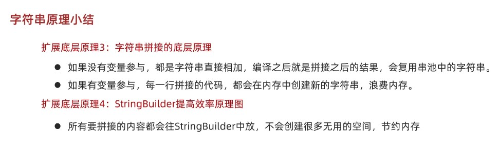

- **StringBuilder 原理**


- **小结**


## ArrayList

ArrayList集合的特点: **长度可以变化，只能存储引用数据类型 (基本数据类型使用包装类)**


## 继承

- **子类能继承的父类中的信息**


- **虚方法表**


所有类继承于 Object, 存在5个虚方法。若子类调用的方法为虚方法表中的方法，则可以直接调用，否则需要到一层一层往父类中寻找该方法进行调用（调用父类的 private 方法报错）

- **继承中成员变量的访问**


- **重写的本质**

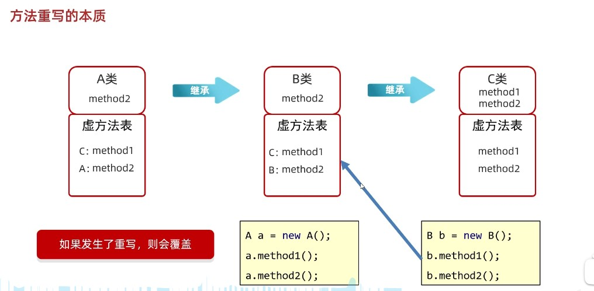

- **方法重写注意事项和要求:**


**只有被添加到虚方法表中的方法才能被重写 (私有方法, 静态方法不能被重写)**


- **继承中构造方法的访问特点**


- this 和 super


虚拟机会把调用者的地址赋值给一个隐藏的 this，在成员方法内使用成员变量时前面也有一个隐藏的 this，因此 **this 就是成员方法内的一个局部变量，对象本身并不包含 this，内存分布中没有 this**

## 多态

- **多态调用成员的特点**


**编译看左边，所以若父类没有这个成员变量或者方法的话会直接报错**

- **多态的优势和弊端**


向上自动类型转换，向下强制类型转换（可能出错，使用 instanceof）

```java
Base base = new Son1();
if (base instanceof Son1) {
    Son1 son = (Son1) base;
    son.func();
}

if (base instanceof Son1 son) {
    son.func();
}

```

- **包 和 final**

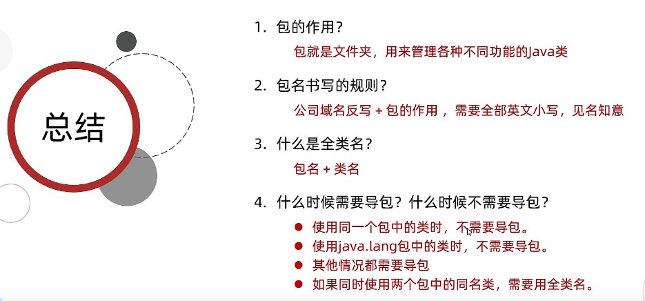


## 权限修饰符和代码块

- **权限修饰符**


- **代码块总结**


## 抽象类和接口

### 抽象类


### 接口

- **接口的定义和使用**


- **接口中成员的特点**


- **接口和类之间的关系**


- **接口中新增的方法**


可以避免工程完成后修改了接口后导致其他类不能正常使用的问题（因为之前都是抽象方法，其他类必须进行重写）


静态方法不能被重写，使用接口名进行调用。即使子类中写了一个函数签名完全一样的函数也不是重写，只是类的方法（只有子类把从父类继承下来的虚方法表里的方法进行了覆盖才叫重写）


JDK8 的时候如果有两个函数中包含了大量重复代码，那么就会将重复代码抽离出来形成一个新默认方法，但是这样这个函数同样可以被外界调用（没有意义，因为这个方法只是自己内部使用，比如记录日志信息）。JDK9就引入了私有方法，用于给默认方法服务，静态私有方法给静态方法服务。

- **总结**
  


- **接口的应用**


- **适配器模式**


## 内部类


- **内部类的分类**
   - 成员内部类（了解）
   - 静态内部类（了解）
   - 局部内部类（了解）
   - **匿名内部类**（掌握）

### 成员内部类

- 成员内部类访问外部类成员

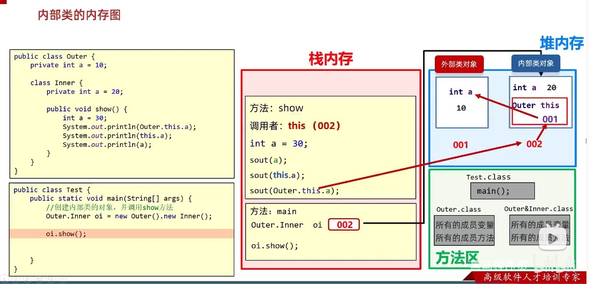

内部类对象有一个隐藏的 this 指向外部类的地址值

- **总结**


### 静态内部类
  


### 局部内部类


### 匿名内部类

- **匿名内部类简介**


- **匿名内部类总结** (P143讲的很好)


## API

### Math 


### System

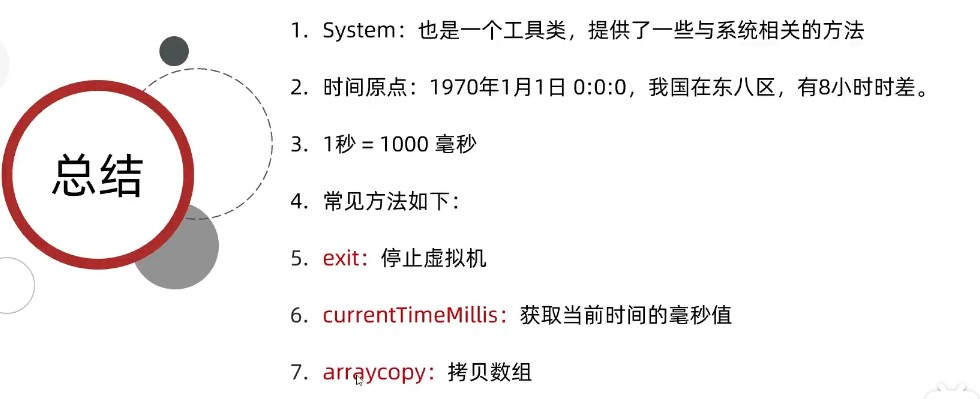

### Runtime


### Object 


默认的 equals 方法比较的是两个地址值，若是想比较两个对象的属性值是否相等需要在类中重写 equals 方法

### Objects 


```java
Student s1 = null;
Student s2 = new Student("zhangsan", 23);

// 报错，空指针异常
// boolean result = s1.equals(s2);

// 必须做非空判断
if (s1 != null) {
  boolean result = s1.equals(s2);
  System.out.println(result);
} else {
  System.out.println("调用者为空，不等");
}

// 简化代码就可以使用 Objects 的 equals, 若为空返回 false
boolean result = Objects.equals(s1, s2);
System.out.println(result);
```

### BigInteger


静态方法会提前构造数字范围为 -16~16 的 BigInterger 对象, 调用的时候若发现范围在 [-16, 16] 内直接返回


底层是用一个整数记录正负号，数字采用 int 类型的数组保存，将原数字先转补码，然后从后往前按照 32 位一组进行划分，把32位表示的整数保存起来即可


### BigDecimal


底层同样使用数组存储 (byte[])，只不过按位逐个存贮（包括点），保存的是每个数字和点在 ASCII 码表中的序号, 


### 正则表达式

- 作用
  - 校验字符串是否满足规则
  - 在一段文本中查找满足要求的内容

```java
String str = new String("1342");
System.out.println(str.matches("\\d{3,}"));
```

#### 正则语法


```java
// Pattern：表示正则表达式
// Matcher：文本匹配器，作用按照正则表达式的规则去读取字符串，从头开始读取。在大串中去找符合匹配规则的子串。

/* 
    有如下文本，请按照要求爬取数据。

Java自从95年问世以来，经历了很多版本，目前企业中用的最多的是Java8和Java11，因为这两个是长期支持版本，下一个长期支持版本是Java17，相信在未来不久Java17也会逐渐登上历史舞台
    
    要求:找出里面所有的JavaXX
 */

String str = "Java自从95年问世以来，经历了很多版本，目前企业中用的最多的是Java8和Java11，" +
        "因为这两个是长期支持版本，下一个长期支持版本是Java17，相信在未来不久Java17也会逐渐登上历史舞台";

//1.获取正则表达式的对象
Pattern p = Pattern.compile("Java\\d{0,2}");
//2.获取文本匹配器的对象
//拿着m去读取str，找符合p规则的子串
Matcher m = p.matcher(str);

//3.利用循环获取
while (m.find()) {
    String s = m.group();
    System.out.println(s);
}

```

#### 条件爬取

1. `(?i)` : 忽略大小写
2. `(?=)` : 进行拼接, 获取的时候只获取 ? 代表的数据
3. `(?:)` : 进行拼接, 获取的时候获取 ? 和 : 拼接得到的完整数据
4. `(?!)` : 进行拼接, 获取的时候获取 ? 和 非后序定义的规则得到的前面数据


```java
/*
    需求1:爬取版本号为8，11.17的Java文本，但是只要Java，不显示版本号。
    需求2:爬取版本号为8，11，17的Java文本。正确爬取结果为:Java8 Java11 Java17 Java17
    需求3:爬取除了版本号为8，11.17的Java文本，
*/

String s = "Java自从95年问世以来，经历了很多版本，目前企业中用的最多的是Java8和Java11，" +
    "因为这两个是长期支持版本，下一个长期支持版本是Java17，相信在未来不久Java17也会逐渐登上历史舞台";

//1.定义正则表达式
//?理解为前面的数据Java
//=表示在Java后面要跟随的数据
//但是在获取的时候，只获取前半部分
//需求1:
String regex1 = "((?i)Java)(?=8|11|17)";
//需求2:
String regex2 = "((?i)Java)(8|11|17)";
String regex3 = "((?i)Java)(?:8|11|17)";
//需求3:
String regex4 = "((?i)Java)(?!8|11|17)";

Pattern p = Pattern.compile(regex4);
Matcher m = p.matcher(s);
while (m.find()) {
    System.out.println(m.group());
}

```

#### 贪婪爬取

- 贪婪爬取: 在爬取数据的时候尽可能的多获取数据（默认是贪婪爬取）
- 非贪婪爬取: 在爬取数据的时候尽可能的少获取数据（在数量词 `+`, `*` 的后面加上 `?` 就表示是非贪婪爬取）


#### 正则表达式在字符串中的使用


#### 捕获分组和非捕获分组

用括号划分组，只看左括号，不看有括号，按照左括号的顺序，从左往右，依次为第一组，第二组，第三组等等

使用组号: `\\组号`，表示把第 x 组的内容再拿出来用一次

- 正则内部使用：`\\组号`
- 正则外部使用：`$组号`

```java
//需求1:判断一个字符串的开始字符和结束字符是否一致?只考虑一个字符
//举例: a123a &abc& a123b(false)
String regex1 = "(.).+\\1";
System.out.println("a123a".matches(regex1));
System.out.println("&abc&".matches(regex1));
System.out.println("a123b".matches(regex1));


//需求2:判断一个字符串的开始部分和结束部分是否一致?可以有多个字符
//举例: abc123abc abc123abd (false)
String regex2 = "(.+).+\\1";
System.out.println("abc123abc".matches(regex2));
System.out.println("abc123abd".matches(regex2));


//需求3:判断一个字符串的开始部分和结束部分是否一致? 开始部分内部每个字符也需要一致
//举例: aaa123aaa aaa123aab
//(.):把首字母看做一组
// \\2:把首字母拿出来再次使用
// *:作用于\\2,表示后面重复的内容出现日次或多次
String regex3 = "((.)\\2*).+\\1";
System.out.println("aaa123aaa".matches(regex3));
System.out.println("aaa123aab".matches(regex3));


//需求4:把重复的内容 替换为 单个的。例如 学学 -> 学, ...

String str = "我要学学编编编编程程程程程程";
//  (.)表示把重复内容的第一个字符看做一组
//  \\1表示第一字符再次出现
//  + 至少一次
//  $1 表示把正则表达式中第一组的内容，再拿出来用
String result = str.replaceAll("(.)\\1+", "$1");
System.out.println(result);
```


在用到了 `(?:), (?=), (?!)` 时，它们表示非捕获分组，不占用组号

> String regex1 ="[1-9]\\d{16}(?:\\d|x|x)\\1"; // 报错，因为不知道哪个是第一组

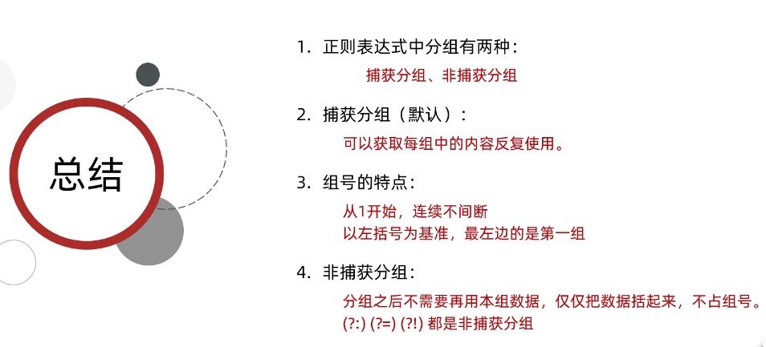

### 时间相关类

#### Data (JDK7)


#### SimpleDateFormat (JDK7)


#### Calendar (JDK7)


\

#### JDK8 的时间相关类


- **ZoneID 时区总结**


- **Instant 时间戳总结**


- **ZoneDateTime 带时区的时间总结**


- **DateTimeFormatter 用于时间的格式化和解析总结**


- **LocalDate 年、月、日**
- **LocalTime 时、分、秒**
- **LocalDateTime 年、月、日、时、分、秒**


- **Duration  时间间隔（秒，纳，秒）**
- **Period  时间间隔（年，月，日）**
- **ChronoUnit  时间间隔（所有单位）**


### 包装类

- **包装类概述**


- **Integer概述**


- **包装类的自动装箱拆箱**


- **Integer方法**


### Arrays

- **Arrays 成员方法**

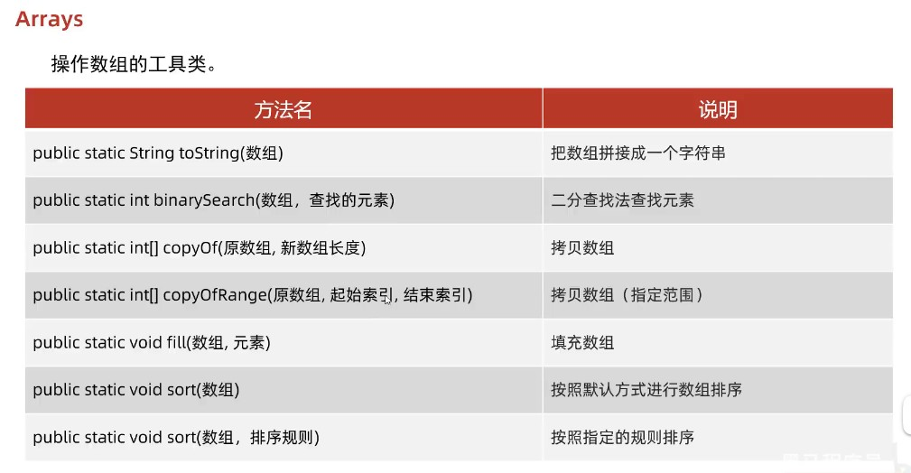

`binarySearch()`: 查找的元素存在返回真实索引, 否则返回 `- 插入点位置 - 1` (这样在正数数组中查找 0 返回 -1, 避免误解)

`copyOf()`: 新数组长度小于老数组长度, 部分拷贝; 新数组长度大于老数组长度, 会补上默认初始值

`copyOfRange()`: 左闭右开

`sort()`: 默认升序; 若想按照指定的规则排序需自定义排序规则, 底层利用插入排序 + 二分查找 进行排序。注意排序规则只能给引用类型的数组进行排序, 参数接收一个接口, 所以传递一个实现了该接口的子类或匿名内部类即可

```java
// compare 方法的参数
// 参数一 o1: 表示在无序序列中，遍历得到的每一个元素
// 参数二 o2: 有序序列中的元素

// 返回值
// 负数：表示当前要插入的元素是小的，放在前面
// 正数：表示当前要插入的元素是大的，放在后面
// 0：表示当前要插入的元素跟比较的元素一样，放在后面

Array.sort(arr, new Comparator<Integer>() {
  @override
  public int compare(Integer o1, Integer o2) {
    return o1 - o2; // 升序
  }
});
```

### Lambda表达式


`() -> {}`


## 集合

- **集合体系结构**


- **单列集合体系结构**


红色的是接口，蓝色的是具体实现类

### Collection

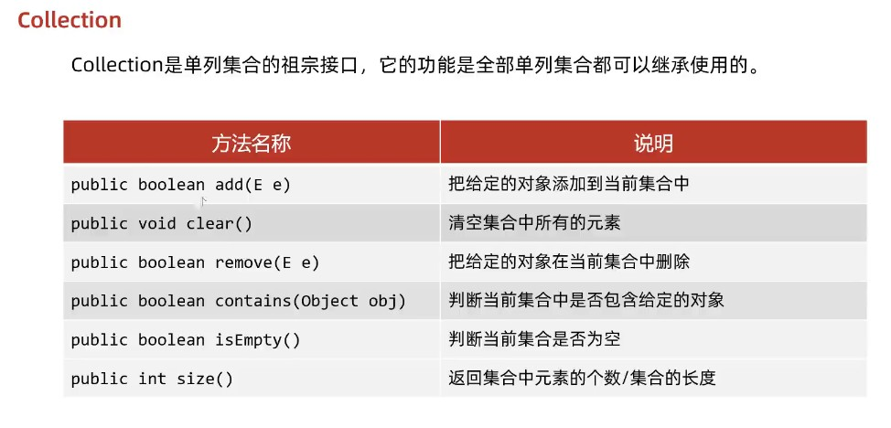

`add`: 往 List 系列集合中添加数据永远返回 true; 往 Set 系列集合中添加已存在的数据返回 false, 否则返回 true

`remove`: 删除的数据存在则返回 true, 否则返回 false

`contains`: 底层是依赖 equals 方法进行判断是否存在的。对于**自定义对象要重写 equals 方法**

- **Collection遍历**

1. **Collection遍历 - 迭代器遍历**


2. **Collection遍历 - 增强for遍历**

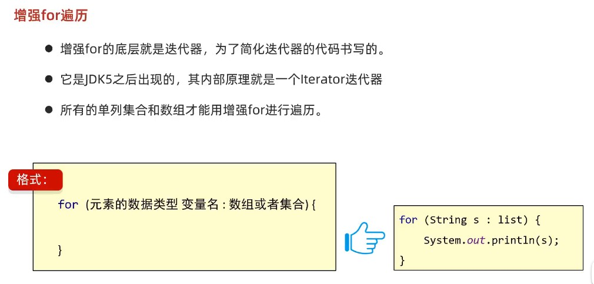


3. **Collection遍历 - Lambda遍历**

```java
Collection<String> coll = new ArrayList<>();
// add();
// 采用匿名内部类遍历，实现 Consumer 函数接口，包含 accept() 方法
// forEach 底层原理
// 遍历集合，依次得到每个元素并将其传递给 accept()

coll.forEach(new Consumer<String>() {
  @override
  public void accept(String s) {
    System.out.println(s);
  }
});

// Lambda 表达式
coll.forEach(s -> System.out.println(s));
```


#### List


- **List集合特有方法**


`add(int index, E element)`: 在指定索引上增加元素，原来索引上的元素会依次往后移

`remove(int index)`: 若集合中本身就保存的整数如 1, 2, 3; 那么想删除整数 1 的话需要手动装箱 (`Integer.valueOf(1)`)，因为对于重载函数而言编译器会优先匹配实参和形参完全一致的方法，会删除索引为 1 的元素

- **List集合的遍历方式**


1. 迭代器遍历
2. **列表迭代器遍历**
3. 增强for遍历
4. Lambda表达式遍历
5. **普通for循环(因为List集合存在索引)**


```java
List<String> list = new ArrayList<>();
// add();

//1. 迭代器
Iterator<String> it = list.iterator();
 while(it.hasNext()){
    String str = it.next();
    System.out.println(str);
}


//2. 增强for
for (String s : list) {
  System.out.println(s);
}


//3. Lambda表达式
list.forEach(s->System.out.println(s));


//4. 普通for循环
//size方法跟get方法还有循环结合的方式，利用索引获取到集合中的每一个元素
for (int i = 0; i < list.size(); i++) {
  String s = list.get(i);
  System.out.println(s);
}


//5. 列表迭代器
//获取一个列表迭代器的对象，里面的指针默认也是指向0索引的
//额外添加了一个方法：在遍历的过程中，可以添加元素
ListIterator<String> it = list.listIterator();
while(it.hasNext()){
    String str = it.next();
    if("bbb".equals(str)){
        it.add("qqq");
    }
}
System.out.println(list);
```

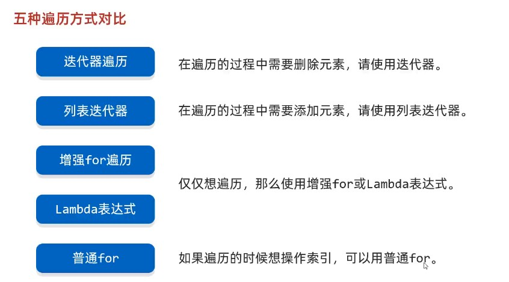

- **各种底层数据结构总结**


#### ArrayList 集合


#### LinkedList 集合

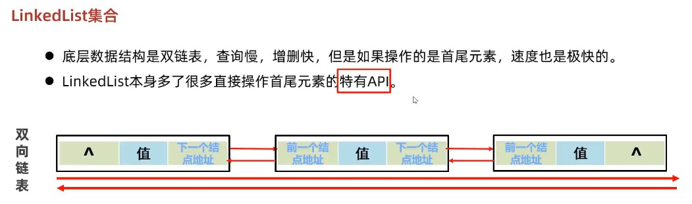


一般只需要用 `Collection` 和 `List` 提供的接口即可，无需使用 `LinkedList` 的特有方法

#### 泛型

Java中是伪泛型，加入时会做检查，但是保存的仍然是 Object，取出时又会从 Object 转为需要的类型。目的是为了向前兼容


```java
public class Test {
  public static void main(String[] args) {
    // 泛型不具备继承性

    ArrayList<Animal> list1 = new ArrayList();
    ArrayList<Dog> list2 = new ArrayList();
    method(list1);
    // 报错, 只能接收数据类型为 Animal 的 ArrayList
    method(list2); 

    // 数据具备继承性，正确

    list1.add(new Animal());
    list1.add(new Dog());
  }

  public static void method(ArrayList<Animal> list) {
  }

}

class Animal {

}

class Dog extends Animal {

}
```

#### Set


HashSet, LinkedHashSet 和 TreeSet 的底层都是 Map


集合中添加重复元素返回值为 false

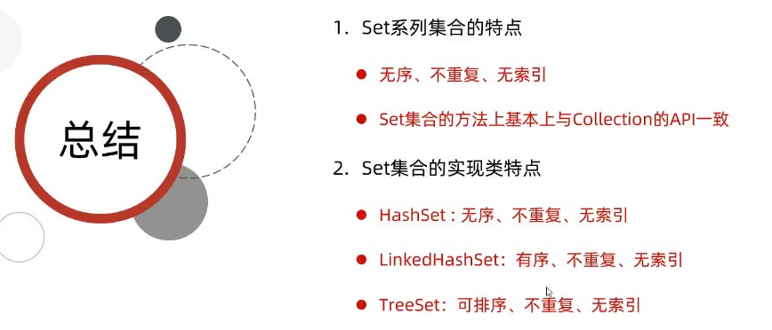

#### HashSet


#### LinkedHashSet


#### TreeSet


### Map


put(K key, V value): 若键存在则会覆盖，返回原值; 若不存在该键则插入，返回 null

- Map 集合的遍历方式

1. 键找值，通过 `keySet()` 方法获取 Map 集合中所有的键的 Set 集合，之后就可以根据 Set 的遍历方式结合 Map 的 `get(K key)` 方法依次遍历 (迭代器，增强for和 Lambda)
2. 键值对，通过 `entrySet()` 方法获取键值对的 Set 集合，之后就可以根据 Set 的遍历方式结合 Map 的 `getKey(), getValue()` 方法依次遍历 (迭代器，增强for和 Lambda)
3. Lambda，利用 `default void forEach(BiConsumer<? super K, ? super V> action)` 方法进行遍历

#### HashMap


#### LinkedHashMap


#### TreeMap


#### HashMap 和 TreeMap 源码

[P14-P19](https://www.bilibili.com/video/BV1yW4y1Y7Ms?p=14)

- **HashMap**

```java

// 看源码之前需要了解的一些内容

Node<K,V>[] table   哈希表结构中数组的名字

DEFAULT_INITIAL_CAPACITY：   数组默认长度16

DEFAULT_LOAD_FACTOR：        默认加载因子0.75

// HashMap里面每一个对象包含以下内容：
// 1.1 链表中的键值对对象, 包含：  
  int hash;         //键的哈希值
  final K key;      //键
  V value;          //值
  Node<K,V> next;   //下一个节点的地址值
			
			
// 1.2 红黑树中的键值对对象, 包含：
  int hash;         		//键的哈希值
  final K key;      		//键
  V value;         	 	//值
  TreeNode<K,V> parent;  	//父节点的地址值
  TreeNode<K,V> left;		//左子节点的地址值
  TreeNode<K,V> right;	//右子节点的地址值
  boolean red;			//节点的颜色
					


// 2.添加元素
HashMap<String,Integer> hm = new HashMap<>();
hm.put("aaa" , 111);
hm.put("bbb" , 222);
hm.put("ccc" , 333);
hm.put("ddd" , 444);
hm.put("eee" , 555);

// 添加元素的时候至少考虑三种情况：
// 2.1数组位置为null
// 2.2数组位置不为null，键不重复，挂在下面形成链表或者红黑树
// 2.3数组位置不为null，键重复，元素覆盖


//返回值：被覆盖元素的值，如果没有覆盖，返回null
public V put(K key, V value) {
  return putVal(hash(key), key, value, false, true);
}


//利用键计算出对应的哈希值，再把哈希值进行一些额外的处理
//简单理解：返回值就是返回键的哈希值
static final int hash(Object key) {
  int h;
  return (key == null) ? 0 : (h = key.hashCode()) ^ (h >>> 16);
}

//参数一：键的哈希值, 参数二：键, 参数三：值, 参数四：如果键重复了是否保留
//true，表示老元素的值保留，不会覆盖
//false，表示老元素的值不保留，会进行覆盖
final V putVal(int hash, K key, V value, boolean onlyIfAbsent,boolean evict) {
  //定义一个局部变量，用来记录哈希表中数组的地址值。
  Node<K,V>[] tab;
  //临时的第三方变量，用来记录键值对对象的地址值
  Node<K,V> p;
  //表示当前数组的长度, 索引
  int n, i;
  //把哈希表中数组的地址值，赋值给局部变量tab
  tab = table;

  if (tab == null || (n = tab.length) == 0) {
    //1.如果当前是第一次添加数据，底层会创建一个默认长度为16，加载因子为0.75的数组
    //2.如果不是第一次添加数据，会看数组中的元素是否达到了扩容的条件
    //如果没有达到扩容条件，底层不会做任何操作
    //如果达到了扩容条件，底层会把数组扩容为原先的两倍，并把数据全部转移到新的哈希表中
    tab = resize();
    //表示把当前数组的长度赋值给n
    n = tab.length;
  }

  //拿着数组的长度跟键的哈希值进行计算，计算出当前键值对对象，在数组中应存入的位置
  i = (n - 1) & hash;//index
  //获取数组中对应元素的数据
  p = tab[i];
  if (p == null) {
    //底层会创建一个键值对对象，直接放到数组当中
    tab[i] = newNode(hash, key, value, null);
  } else {
    Node<K,V> e;
    K k;
    //等号的左边：数组中键值对的哈希值; 等号的右边：当前要添加键值对的哈希值
    //如果键不一样，此时返回false
    //如果键一样，返回true
    boolean b1 = p.hash == hash;
    if (b1 && ((k = p.key) == key || (key != null && key.equals(k)))) {
      e = p;
    } else if (p instanceof TreeNode) {
      //判断数组中获取出来的键值对是不是红黑树中的节点
      //如果是，则调用方法putTreeVal，把当前的节点按照红黑树的规则添加到树当中。
      e = ((TreeNode<K,V>)p).putTreeVal(this, tab, hash, key, value);
    } else {
      //如果从数组中获取出来的键值对不是红黑树中的节点
      //表示此时下面挂的是链表
      for (int binCount = 0; ; ++binCount) {
          if ((e = p.next) == null) {
            //此时就会创建一个新的节点，挂在下面形成链表
            p.next = newNode(hash, key, value, null);
            //判断当前链表长度是否超过8，如果超过8，就会调用方法treeifyBin
            //treeifyBin方法的底层还会继续判断
            //判断数组的长度是否大于等于64
            //如果同时满足这两个条件，就会把这个链表转成红黑树
              if (binCount >= TREEIFY_THRESHOLD - 1)
                  treeifyBin(tab, hash);
              break;
          }
          //e 0x0044  ddd  444
          //要添加的元素： 0x0055   ddd   555
          //如果哈希值一样，就会调用equals方法比较内部的属性值是否相同
          if (e.hash == hash && ((k = e.key) == key || (key != null && key.equals(k)))) {
            break;
          }
          p = e;
      }
    }

    //如果e为null，表示当前不需要覆盖任何元素
    //如果e不为null，表示当前的键是一样的，值会被覆盖
    //e:0x0044  ddd  555
    //要添加的元素： 0x0055   ddd   555
    if (e != null) {
      V oldValue = e.value;
      if (!onlyIfAbsent || oldValue == null) {
        //等号的右边：当前要添加的值; 等号的左边：0x0044的值
        e.value = value;
      }
      afterNodeAccess(e);
      return oldValue;
    }
  }

  //threshold：记录的就是数组的长度 * 0.75，哈希表的扩容时机  16 * 0.75 = 12
  if (++size > threshold) {
    resize();
  }

  //表示当前没有覆盖任何元素，返回null
  return null;
}

```

- **TreeMap**

```java
// 1.TreeMap中每一个节点的内部属性
K key;					//键
V value;				//值
Entry<K,V> left;		//左子节点
Entry<K,V> right;		//右子节点
Entry<K,V> parent;		//父节点
boolean color;			//节点的颜色


// 2.TreeMap类中中要知道的一些成员变量
public class TreeMap<K,V> {
   
  //比较器对象
  private final Comparator<? super K> comparator;

  //根节点
  private transient Entry<K,V> root;

  //集合的长度
  private transient int size = 0;

  // 3.空参构造，空参构造就是没有传递比较器对象
  public TreeMap() {
    comparator = null;
  }

  // 4.带参构造，带参构造就是传递了比较器对象。
  public TreeMap(Comparator<? super K> comparator) {
    this.comparator = comparator;
  }
	
  // 5.添加元素
  public V put(K key, V value) {
    return put(key, value, true);
  }

  // 参数三：当键重复的时候，是否需要覆盖值 (true：覆盖, false：不覆盖)
  private V put(K key, V value, boolean replaceOld) {
    //获取根节点的地址值，赋值给局部变量t
    Entry<K,V> t = root;
    //判断根节点是否为null, 为null就把当前添加的元素当做根节点；否则跳过这个判断继续执行下面的代码
    if (t == null) {
      //方法的底层，会创建一个Entry对象，把他当做根节点
      addEntryToEmptyMap(key, value);
      //表示此时没有覆盖任何的元素
      return null;
    }
    //表示两个元素的键比较之后的结果
    int cmp;
    //表示当前要添加节点的父节点
    Entry<K,V> parent;

    //表示当前的比较规则
    //如果我们是采取默认的自然排序，那么此时comparator记录的是null，cpr记录的也是null
    //如果我们是采取比较去排序方式，那么此时comparator记录的是就是比较器
    Comparator<? super K> cpr = comparator;
    //如果传递了比较器对象，就执行if里面的代码，此时以比较器的规则为准
    //如果没有传递比较器对象，就执行else里面的代码，此时以自然排序的规则为准
    if (cpr != null) {
      do {
        parent = t;
        cmp = cpr.compare(key, t.key);
        if (cmp < 0)
          t = t.left;
        else if (cmp > 0)
          t = t.right;
        else {
          V oldValue = t.value;
          if (replaceOld || oldValue == null) {
            t.value = value;
          }
          return oldValue;
        }
      } while (t != null);
    } else {
      //把键进行强转，强转成Comparable类型的
      //要求：键必须要实现Comparable接口，如果没有实现这个接口，此时在强转的时候，就会报错。
      Comparable<? super K> k = (Comparable<? super K>) key;
      do {
        //把根节点当做当前节点的父节点
        parent = t;
        //调用compareTo方法，比较根节点和当前要添加节点的大小关系。小于0往左，大于0往右，为0则覆盖
        cmp = k.compareTo(t.key);
        if (cmp < 0)
          t = t.left;
        else if (cmp > 0)
          t = t.right;
        else {
          V oldValue = t.value;
          if (replaceOld || oldValue == null) {
            t.value = value;
          }
          return oldValue;
        }
      } while (t != null);
    }
    //就会把当前节点按照指定的规则进行添加
    addEntry(key, value, parent, cmp < 0);
    return null;
  }	
	
  private void addEntry(K key, V value, Entry<K, V> parent, boolean addToLeft) {
    Entry<K,V> e = new Entry<>(key, value, parent);
    if (addToLeft)
      parent.left = e;
    else
      parent.right = e;
    //添加完毕之后，需要按照红黑树的规则进行调整
    fixAfterInsertion(e);
    size++;
    modCount++;
  }
	
	
	
  private void fixAfterInsertion(Entry<K,V> x) {
    //因为红黑树的节点默认就是红色的
    x.color = RED;

    //按照红黑规则进行调整
    //parentOf:获取x的父节点，parentOf(parentOf(x)):获取x的爷爷节点
    //leftOf:获取左子节点
    while (x != null && x != root && x.parent.color == RED) {

      //判断当前节点的父节点是爷爷节点的左子节点还是右子节点。目的是为了获取当前节点的叔叔节点
      if (parentOf(x) == leftOf(parentOf(parentOf(x)))) {
        //表示当前节点的父节点是爷爷节点的左子节点
        //那么下面就可以用rightOf获取到当前节点的叔叔节点
        Entry<K,V> y = rightOf(parentOf(parentOf(x)));
        //叔叔节点为红色的处理方案
        if (colorOf(y) == RED) {
          //把父节点设置为黑色
          setColor(parentOf(x), BLACK);
          //把叔叔节点设置为黑色
          setColor(y, BLACK);
          //把爷爷节点设置为红色
          setColor(parentOf(parentOf(x)), RED);
          //把爷爷节点设置为当前节点
          x = parentOf(parentOf(x));
        } else {
          //叔叔节点为黑色的处理方案
          //表示判断当前节点是否为父节点的右子节点
          if (x == rightOf(parentOf(x))) {
            //表示当前节点是父节点的右子节点
            x = parentOf(x);
            //左旋
            rotateLeft(x);
          }
          setColor(parentOf(x), BLACK);
          setColor(parentOf(parentOf(x)), RED);
          rotateRight(parentOf(parentOf(x)));
        }
      } else {
        //表示当前节点的父节点是爷爷节点的右子节点
        //那么下面就可以用leftOf获取到当前节点的叔叔节点
        Entry<K,V> y = leftOf(parentOf(parentOf(x)));
        if (colorOf(y) == RED) {
          setColor(parentOf(x), BLACK);
          setColor(y, BLACK);
          setColor(parentOf(parentOf(x)), RED);
          x = parentOf(parentOf(x));
        } else {
          if (x == leftOf(parentOf(x))) {
            x = parentOf(x);
            rotateRight(x);
          }
          setColor(parentOf(x), BLACK);
          setColor(parentOf(parentOf(x)), RED);
          rotateLeft(parentOf(parentOf(x)));
        }
      }
    }
    //把根节点设置为黑色
    root.color = BLACK;
  }
}

/*
思考问题：

6.1 TreeMap添加元素的时候，键是否需要重写hashCode和equals方法？
  不需要重写的。

6.2 HashMap是哈希表结构的，JDK8开始由数组，链表，红黑树组成的。既然有红黑树，HashMap的键是否需要实现Compareable接口或者传递比较器对象呢？
  不需要的，因为在HashMap的底层，默认是利用哈希值的大小关系来创建红黑树的

6.3 TreeMap和HashMap谁的效率更高？
  如果是最坏情况，添加了8个元素，这8个元素形成了链表，此时TreeMap的效率要更高
  但是这种情况出现的几率非常的少。一般而言，还是HashMap的效率要更高。

6.4 你觉得在Map集合中，java会提供一个如果键重复了，不会覆盖的put方法呢？
  此时putIfAbsent本身不重要。
  传递一个思想：代码中的逻辑都有两面性，如果我们只知道了其中的A面，而且代码中还发现了有变量可以控制两面性的发生。
  那么该逻辑一定会有B面。

6.5 三种双列集合 (HashMap LinkedHashMap TreeMap)，以后如何选择？
  默认：HashMap（效率最高）
  如果要保证存取有序：LinkedHashMap
  如果要进行排序：TreeMap
*/
```

#### 可变参数


```java
public class ChangeArgs {
  public static void main(String[] args) {
    int sum = getSum(6, 7, 2, 12, 2121);
    System.out.println(sum);
  }

  public static int getSum(int... arr) {
    int sum = 0;
    for (int a : arr) {
      sum += a;
    }
    return sum;
  }
}
```

#### Collections


### 不可变集合


```java
public class ImmutableDemo4 {
  public static void main(String[] args) {
    //创建Map的不可变集合,键值对的数量超过10个

    //1.创建一个普通的Map集合
    HashMap<String, String> hm = new HashMap<>();
    hm.put("张三", "南京");
    //...

    //2.利用上面的数据来获取一个不可变的集合，调用 ofEntries()
    /*
    //获取到所有的键值对对象（Entry对象）
    Set<Map.Entry<String, String>> entries = hm.entrySet();
    //把entries变成一个数组
    Map.Entry[] arr1 = new Map.Entry[0];
    //toArray方法在底层会比较集合的长度跟数组的长度两者的大小
    //如果集合的长度 > 数组的长度 ：数据在数组中放不下，此时会根据实际数据的个数，重新创建数组
    //如果集合的长度 <= 数组的长度：数据在数组中放的下，此时不会创建新的数组，而是直接用
    Map.Entry[] arr2 = entries.toArray(arr1);
    //不可变的map集合
    Map map = Map.ofEntries(arr2);
    map.put("bbb","222"); // 报错
    */

    // 简写
    //Map<Object, Object> map = Map.ofEntries(hm.entrySet().toArray(new Map.Entry[0]));

    // 调用 copyOf 方法，底层会调用Map.ofEntries(hm.entrySet().toArray(new Map.Entry[0])); JDK10以后才行
    Map<String, String> map = Map.copyOf(hm);
    map.put("bbb","222"); // 报错
  }
}
```

### Stream流

- 得到 Stream 流


- Stream 流的中间方法


- Stream 流的终结方法


```java
/**
Stream流的收集方法 toMap方法演示
创建一个ArrayList集合，并添加以下字符串。字符串中前面是姓名，后面是年龄
"zhangsan,23"
"lisi,24"
"wangwu,25"
保留年龄大于等于24岁的人，并将结果收集到Map集合中，姓名为键，年龄为值
*/
public class MyStream8 {
  public static void main(String[] args) {
    ArrayList<String> list = new ArrayList<>();
    list.add("zhangsan,23");
    list.add("lisi,24");
    list.add("wangwu,25");

    List<String> list1 = list.stream().collect(Collectors.toList());
    System.out.println(list1);

    Set<String> set1 = list.stream().collect(Collectors.toSet());
    System.out.println(set1);

    Map<String, Integer> map = list.stream().filter(
      s -> {
        String[] split = s.split(",");
        int age = Integer.parseInt(split[1]);
        return age >= 24;
    }

    //collect方法只能获取到流中剩余的每一个数据.
    //在底层不能创建容器,也不能把数据添加到容器当中
    //Collectors.toMap 创建一个map集合并将数据添加到集合当中
    // s 依次表示流中的每一个数据
    //第一个lambda表达式就是如何获取到Map中的键
    //第二个lambda表达式就是如何获取Map中的值
    ).collect(Collectors.toMap(
      s -> s.split(",")[0],
      s -> Integer.parseInt(s.split(",")[1])));

    System.out.println(map);
  }
}
```


### 方法引用


## 异常


- 异常的处理方法


- 异常中的常见方法


- 抛出异常


- 自定义异常


## File


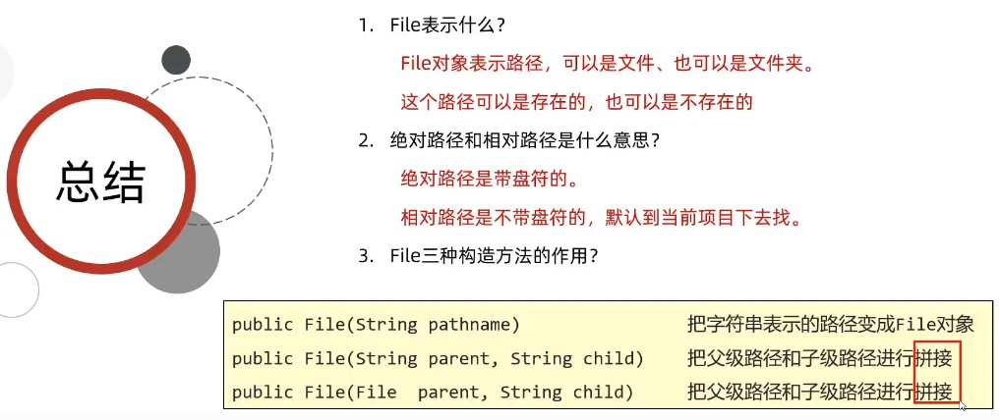


## IO 流


### 字节流


### 字符集


### 字符流 (讲原理 P93-P94)


- 字符流原理


- 字节流和字符流的使用场景


### 高级流


- 缓冲流


原理：P100

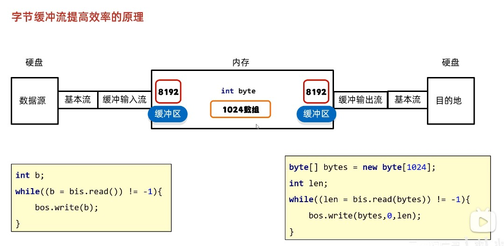


字符缓冲流效率提升不明显，因为本来字符流就自带缓冲区


- 转换流


- 序列化流


- 打印流


- 压缩流


```java
/*
*   解压缩流
* */
public class ZipStreamDemo1 {
  public static void main(String[] args) throws IOException {
    //1.创建一个File表示要解压的压缩包
    File src = new File("D:\\aaa.zip");
    //2.创建一个File表示解压的目的地
    File dest = new File("D:\\");
    //调用方法
    unzip(src,dest);
  }

  //定义一个方法用来解压
  public static void unzip(File src,File dest) throws IOException {
    //解压的本质：把压缩包里面的每一个文件或者文件夹读取出来，按照层级拷贝到目的地当中
    //创建一个解压缩流用来读取压缩包中的数据
    ZipInputStream zip = new ZipInputStream(new FileInputStream(src));
    //要先获取到压缩包里面的每一个zipentry对象
    //表示当前在压缩包中获取到的文件或者文件夹
    ZipEntry entry;
    while((entry = zip.getNextEntry()) != null) {
      System.out.println(entry);
      if(entry.isDirectory()) {
        //文件夹：需要在目的地dest处创建一个同样的文件夹
        File file = new File(dest,entry.toString());
        file.mkdirs();
      } else {
        //文件：需要读取到压缩包中的文件，并把他存放到目的地dest文件夹中（按照层级目录进行存放）
        FileOutputStream fos = new FileOutputStream(new File(dest,entry.toString()));
        int b;
        while((b = zip.read()) != -1){
          //写到目的地
          fos.write(b);
        }
        fos.close();
        //表示在压缩包中的一个文件处理完毕了。
        zip.closeEntry();
      }
    }
    zip.close();
  }
}
```

```java
/*
 *   压缩流
 *      需求： 把D:\\aaa文件夹压缩成一个压缩包
 * */
public class ZipStreamDemo2 {
  public static void main(String[] args) throws IOException {
    //1.创建File对象表示要压缩的文件夹
    File src = new File("D:\\aaa");
    //2.创建File对象表示压缩包放在哪里（压缩包的父级路径）
    File destParent = src.getParentFile(); //D:\\
    //3.创建File对象表示压缩包的路径
    File dest = new File(destParent, src.getName() + ".zip");
    //4.创建压缩流关联压缩包
    ZipOutputStream zos = new ZipOutputStream(new FileOutputStream(dest));
    //5.获取src里面的每一个文件，变成ZipEntry对象，放入到压缩包当中
    toZip(src, zos, src.getName()); //aaa
    //6.释放资源
    zos.close();
  }

  /*
  *   作用：获取src里面的每一个文件，变成ZipEntry对象，放入到压缩包当中
  *   参数一：数据源
  *   参数二：压缩流
  *   参数三：压缩包内部的路径
  * */
  public static void toZip(File src, ZipOutputStream zos, String name) throws IOException {
    //1.进入src文件夹
    File[] files = src.listFiles();
    //2.遍历数组
    for (File file : files) {
      if(file.isFile()) {
        //3.判断-文件，变成ZipEntry对象，放入到压缩包当中
        ZipEntry entry = new ZipEntry(name + "\\" + file.getName()); //aaa\\no1\\a.txt
        zos.putNextEntry(entry);
        //读取文件中的数据，写到压缩包
        FileInputStream fis = new FileInputStream(file);
        int b;
        while((b = fis.read()) != -1){
          zos.write(b);
        }
        fis.close();
        zos.closeEntry();
      } else {
        //4.判断-文件夹，递归
        toZip(file,zos,name + "\\" + file.getName());
        //     no1            aaa   \\   no1
      }
    }
  }
}
```

### 工具包

- Commons-io 工具包


- Hutool 工具包


## 多线程


1. **继承Thread类**

   - 定义一个类MyThread继承Thread类
   - 在MyThread类中重写run()方法
   - 创建MyThread类的对象
   - 启动线程

2. **实现Runnable接口**

   - 定义一个类MyRunnable实现Runnable接口
   - 在MyRunnable类中重写run()方法
   - 创建MyRunnable类的对象
   - 创建Thread类的对象，把MyRunnable对象作为构造方法的参数
   - 启动线程

3. **实现Callable接口**

   - 定义一个类MyCallable实现Callable接口
   - 在MyCallable类中重写call()方法
   - 创建MyCallable类的对象
   - 创建Future的实现类FutureTask对象，把MyCallable对象作为构造方法的参数
   - 创建Thread类的对象，把FutureTask对象作为构造方法的参数
   - 启动线程
   - 再调用get方法，就可以获取线程结束之后的结果。


设置守护线程是指某个线程可以在其他线程执行完毕后结束而不必等起执行完毕

礼让线程只调用后让出CPU使用权，然后所有线程再重新争抢，当前线程仍可能再次抢到CPU使用权


- 线程同步


java中线程没有定义运行态，当处于就绪态的线程获得 CPU 资源后会被交给操作系统进行处理而不是虚拟机管理


- 线程池


临时线程是在阻塞队列满了以后才开始创建的，用于执行后序不在阻塞队列中的任务。所以任务的执行顺序跟加入线程池的顺序不一定一致


- 其他面试重点

[自定义线程池, volatile, 原子性, CAS, Synchronized](多线程（额外扩展）.md)

## 网络编程


- InetAddress：此类表示Internet协议（IP）地址

| 方法名                                    | 说明                                                         |
| ----------------------------------------- | ------------------------------------------------------------ |
| static InetAddress getByName(String host) | 确定主机名称的IP地址。主机名称可以是机器名称，也可以是IP地址 |
| String getHostName()                      | 获取此IP地址的主机名                                         |
| String getHostAddress()                   | 返回文本显示中的IP地址字符串                                 |

### UDP 通信


- DatagramSocket 和 

| 方法名                                                      | 说明                                                 |
| ----------------------------------------------------------- | ---------------------------------------------------- |
| DatagramSocket()                                            | 创建数据报套接字并将其绑定到本机地址上的任何可用端口 |

| 方法名                         | 说明                   |
| ------------------------------ | ---------------------- |
| void send(DatagramPacket p)    | 发送数据报包           |
| void close()                   | 关闭数据报套接字       |
| void receive(DatagramPacket p) | 从此套接字接受数据报包 |

- DatagramPacket

| 方法名                                                      | 说明                                                 |
| ----------------------------------------------------------- | ---------------------------------------------------- |
| DatagramPacket(byte[] buf,int len,InetAddress add,int port) | 创建数据包,发送长度为len的数据包到指定主机的指定端口 |
| DatagramPacket(byte[] buf, int len) | 创建一个DatagramPacket用于接收长度为len的数据包 |

| 方法名                         | 说明                   |
| ------------------------------ | ---------------------- |
| byte[]  getData() | 返回数据缓冲区                           |
| int  getLength()  | 返回要发送的数据的长度或接收的数据的长度 |

```java
/*
  UDP发送数据：
  数据来自于键盘录入，直到输入的数据是886，发送数据结束
*/
public class SendDemo {
  public static void main(String[] args) throws IOException {
    //创建发送端的Socket对象(DatagramSocket)
    DatagramSocket ds = new DatagramSocket();
    //键盘录入数据
    Scanner sc = new Scanner(System.in);
    while (true) {
      String s = sc.nextLine();
      //输入的数据是886，发送数据结束
      if ("886".equals(s)) {
        break;
      }
      //创建数据，并把数据打包
      byte[] bys = s.getBytes();
      DatagramPacket dp = new DatagramPacket(bys, bys.length, InetAddress.getByName("192.168.1.66"), 12345);
      //调用DatagramSocket对象的方法发送数据
      ds.send(dp);
    }
    //关闭发送端
    ds.close();
  }
}

/*
  UDP接收数据：
  因为接收端不知道发送端什么时候停止发送，故采用死循环接收
*/
public class ReceiveDemo {
  public static void main(String[] args) throws IOException {
    //创建接收端的Socket对象(DatagramSocket)
    DatagramSocket ds = new DatagramSocket(12345);
    while (true) {
      //创建一个数据包，用于接收数据
      byte[] bys = new byte[1024];
      DatagramPacket dp = new DatagramPacket(bys, bys.length);
      //调用DatagramSocket对象的方法接收数据
      ds.receive(dp);
      //解析数据包，并把数据在控制台显示
      System.out.println("数据是：" + new String(dp.getData(), 0, dp.getLength()));
    }
    // 关闭接收端
    // ds.close();
  }
}
```

- **UDP组播实现步骤**

  - 发送端
    1. 创建发送端的Socket对象(DatagramSocket)
    2. 创建数据，并把数据打包(DatagramPacket)
    3. 调用DatagramSocket对象的方法发送数据(在单播中,这里是发给指定IP的电脑但是在组播当中,这里是发给组播地址)
    4. 释放资源
  - 接收端
    1. 创建接收端Socket对象(MulticastSocket)
    2. 创建一个箱子,用于接收数据
    3. 把当前计算机绑定一个组播地址
    4. 将数据接收到箱子中
    5. 解析数据包,并打印数据
    6. 释放资源

```java
// 发送端
public class ClinetDemo {
  public static void main(String[] args) throws IOException {
    // 1. 创建发送端的Socket对象(DatagramSocket)
    DatagramSocket ds = new DatagramSocket();
    String s = "hello 组播";
    byte[] bytes = s.getBytes();
    InetAddress address = InetAddress.getByName("224.0.1.0");
    int port = 10000;
    // 2. 创建数据，并把数据打包(DatagramPacket)
    DatagramPacket dp = new DatagramPacket(bytes,bytes.length,address,port);
    // 3. 调用DatagramSocket对象的方法发送数据(在单播中,这里是发给指定IP的电脑但是在组播当中,这里是发给组播地址)
    ds.send(dp);
    // 4. 释放资源
    ds.close();
  }
}

// 接收端
public class ServerDemo {
  public static void main(String[] args) throws IOException {
    // 1. 创建接收端Socket对象(MulticastSocket)
    MulticastSocket ms = new MulticastSocket(10000);
    // 2. 创建一个箱子,用于接收数据
    DatagramPacket dp = new DatagramPacket(new byte[1024],1024);
    // 3. 把当前计算机绑定一个组播地址,表示添加到这一组中.
    ms.joinGroup(InetAddress.getByName("224.0.1.0"));
    // 4. 将数据接收到箱子中
    ms.receive(dp);
    // 5. 解析数据包,并打印数据
    byte[] data = dp.getData();
    int length = dp.getLength();
    System.out.println(new String(data,0,length));
    // 6. 释放资源
    ms.close();
  }
}
```

- **UDP广播实现步骤**

  - 发送端
    1. 创建发送端Socket对象(DatagramSocket)
    2. 创建存储数据的箱子,将广播地址封装进去
    3. 发送数据
    4. 释放资源
  - 接收端
    1. 创建接收端的Socket对象(DatagramSocket)
    2. 创建一个数据包，用于接收数据
    3. 调用DatagramSocket对象的方法接收数据
    4. 解析数据包，并把数据在控制台显示
    5. 关闭接收端

```java
// 发送端
public class ClientDemo {
  public static void main(String[] args) throws IOException {
    // 1. 创建发送端Socket对象(DatagramSocket)
    DatagramSocket ds = new DatagramSocket();
    // 2. 创建存储数据的箱子,将广播地址封装进去
    String s = "广播 hello";
    byte[] bytes = s.getBytes();
    InetAddress address = InetAddress.getByName("255.255.255.255");
    int port = 10000;
    DatagramPacket dp = new DatagramPacket(bytes,bytes.length,address,port);
    // 3. 发送数据
    ds.send(dp);
    // 4. 释放资源
    ds.close();
  }
}

// 接收端
public class ServerDemo {
  public static void main(String[] args) throws IOException {
    // 1. 创建接收端的Socket对象(DatagramSocket)
    DatagramSocket ds = new DatagramSocket(10000);
    // 2. 创建一个数据包，用于接收数据
    DatagramPacket dp = new DatagramPacket(new byte[1024],1024);
    // 3. 调用DatagramSocket对象的方法接收数据
    ds.receive(dp);
    // 4. 解析数据包，并把数据在控制台显示
    byte[] data = dp.getData();
    int length = dp.getLength();
    System.out.println(new String(data,0,length));
    // 5. 关闭接收端
    ds.close();
  }
}
```

### TCP 通信


```java
public class Client {
  // TCP协议，发送数据
  public static void main(String[] args) throws IOException {
    // 1.创建Socket对象
    // 细节：在创建对象的同时会连接服务端
    //      如果连接不上，代码会报错
    Socket socket = new Socket("127.0.0.1",10000);

    // 2.可以从连接通道中获取输出流
    OutputStream os = socket.getOutputStream();
    // 写出数据
    os.write("你好你好".getBytes()); //12字节

    // 3.释放资源
    os.close();
    socket.close();
  }
}

// 服务端
public class Server {
  // TCP协议，接收数据
  public static void main(String[] args) throws IOException {
    // 1.创建对象ServerSocker
    ServerSocket ss = new ServerSocket(10000);

    // 2.监听客户端的链接
    Socket socket = ss.accept();

    // 3.从连接通道中获取输入流读取数据
    // 只用字节流的话传输中文会乱码，需要改为字符流，为了提高效率可以再次改为缓冲流
    InputStream is = socket.getInputStream(); 
    InputStreamReader isr = new InputStreamReader(is);
    BufferedReader br = new BufferedReader(isr);

    // BufferedReader br = new BufferedReader(new InputStreamReader(socket.getInputStream()));
    int b;
    while ((b = br.read()) != -1){
       System.out.print((char) b);
    }

    // 4.释放资源
    socket.close();
    ss.close();

  }
}
```


## 反射


### 动态代理

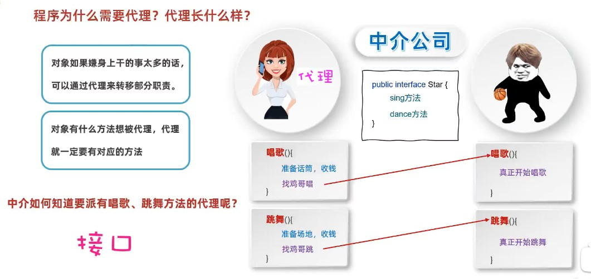


```java
public class Test {
    public static void main(String[] args) {
    /*
        需求：
            外面的人想要大明星唱一首歌
             1. 获取代理的对象
                代理对象 = ProxyUtil.createProxy(大明星的对象);
             2. 再调用代理的唱歌方法
                代理对象.唱歌的方法("只因你太美");
     */
        //1. 获取代理的对象
        BigStar bigStar = new BigStar("鸡哥");
        Star proxy = ProxyUtil.createProxy(bigStar);

        //2. 调用唱歌的方法
        String result = proxy.sing("只因你太美");
        System.out.println(result);
    }
}
```

```java
/*
*
* 类的作用：
*       创建一个代理
*
* */
public class ProxyUtil {
  /*
  * 方法的作用：
  *       给一个明星的对象，创建一个代理
  *
  *  形参：
  *       被代理的明星对象
  *
  *  返回值：
  *       给明星创建的代理
  *
  * 需求：
  *   外面的人想要大明星唱一首歌
  *   1. 获取代理的对象
  *      代理对象 = ProxyUtil.createProxy(大明星的对象);
  *   2. 再调用代理的唱歌方法
  *      代理对象.唱歌的方法("只因你太美");
  * */
  public static Star createProxy(BigStar bigStar) {

    /* java.lang.reflect.Proxy类：提供了为对象产生代理对象的方法：

    public static Object newProxyInstance(ClassLoader loader, Class<?>[] interfaces, InvocationHandler h)
    参数一：用于指定用哪个类加载器，去加载生成的代理类
    参数二：指定接口，这些接口用于指定生成的代理长什么，也就是有哪些方法
    参数三：用来指定生成的代理对象要干什么事情*/

    Star star = (Star) Proxy.newProxyInstance(
      ProxyUtil.class.getClassLoader(), //参数一：用于指定用哪个类加载器，去加载生成的代理类
      new Class[]{Star.class}, //参数二：指定接口，这些接口用于指定生成的代理长什么，也就是有哪些方法
      //参数三：用来指定生成的代理对象要干什么事情
      new InvocationHandler() {
        @Override
        public Object invoke(Object proxy, Method method, Object[] args) throws Throwable {
          /*
          * 参数一：代理的对象
          * 参数二：要运行的方法 sing
          * 参数三：调用sing方法时，传递的实参
          * */
          if("sing".equals(method.getName())) {
            System.out.println("准备话筒，收钱");
          }else if("dance".equals(method.getName())) {
            System.out.println("准备场地，收钱");
          }
          //去找大明星开始唱歌或者跳舞
          //代码的表现形式：调用大明星里面唱歌或者跳舞的方法
          return method.invoke(bigStar,args);
        }
      }
    );
    return star;
  }
}

//我们可以把所有想要被代理的方法定义在接口当中
public interface Star {
    //唱歌
    public abstract String sing(String name);
    //跳舞
    public abstract void dance();
}

public class BigStar implements Star {
  private String name;

  public BigStar() {
  }

  public BigStar(String name) {
    this.name = name;
  }

  //唱歌
  @Override
  public String sing(String name){
    System.out.println(this.name + "正在唱" + name);
    return "谢谢";
  }

  //跳舞
  @Override
  public void dance(){
    System.out.println(this.name + "正在跳舞");
  }

  public String getName() {
    return name;
  }

  public void setName(String name) {
    this.name = name;
  }

  public String toString() {
    return "BigStar{name = " + name + "}";
  }
}

```


