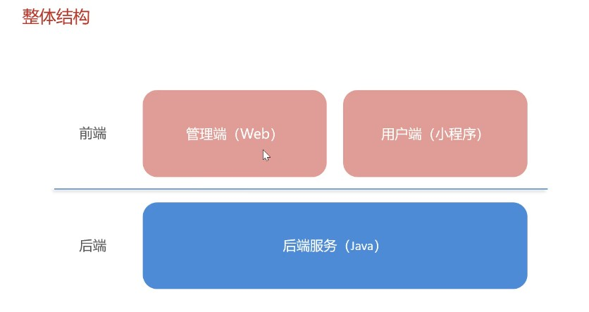
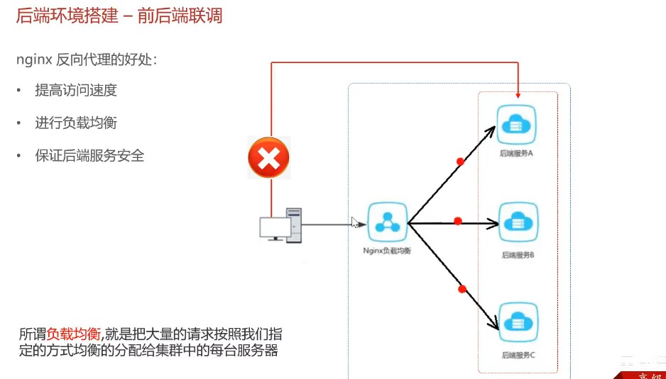
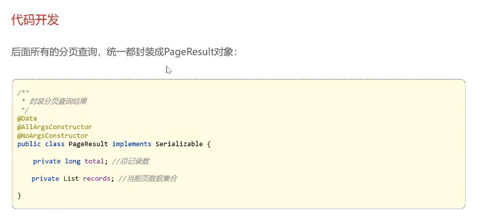

## 项目整体介绍





## 开发环境搭建

- 后端环境搭建





- 完善登陆功能


## Swagger


1. 导入 knife4j 的maven坐标

```xml
<!--在pom.xml中添加依赖 -->
<dependency>
    <groupId>com.github.xiaoymin</groupId>
    <artifactId>knife4j-spring-boot-starter</artifactId>
</dependency>
```

2. 在配置类中加入 knife4j 相关配置

```java
// WebMvcConfiguration.java

/**
    * 通过knife4j生成接口文档
    * @return
*/
    @Bean
    public Docket docket() {
        ApiInfo apiInfo = new ApiInfoBuilder()
                .title("苍穹外卖项目接口文档")
                .version("2.0")
                .description("苍穹外卖项目接口文档")
                .build();
        Docket docket = new Docket(DocumentationType.SWAGGER_2)
                .apiInfo(apiInfo)
                .select()
                .apis(RequestHandlerSelectors.basePackage("com.sky.controller"))
                .paths(PathSelectors.any())
                .build();
        return docket;
    }
```

3. 设置静态资源映射，否则接口文档页面无法访问

```java
// WebMvcConfiguration.java
/**
    * 设置静态资源映射
    * @param registry
*/
protected void addResourceHandlers(ResourceHandlerRegistry registry) {
        registry.addResourceHandler("/doc.html").addResourceLocations("classpath:/META-INF/resources/");
        registry.addResourceHandler("/webjars/**").addResourceLocations("classpath:/META-INF/resources/webjars/");
}
```


## 员工管理、分类管理

- 新增员工


- 员工分页查询




日期显示存在问题


- 启用禁用员工账号


- 编辑员工


- 分类管理模块

基本同员工管理模块


## 菜品管理

- 公共字段填充


- 新增菜品


- 菜品分页查询

- 删除菜品

- 修改菜品

