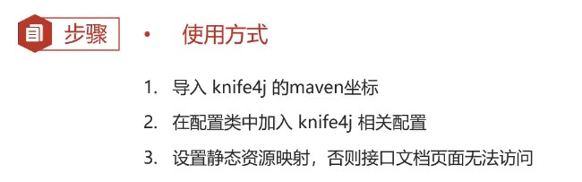
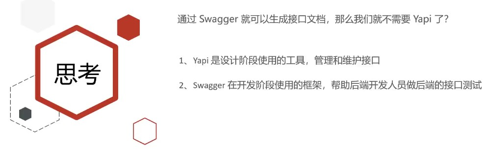
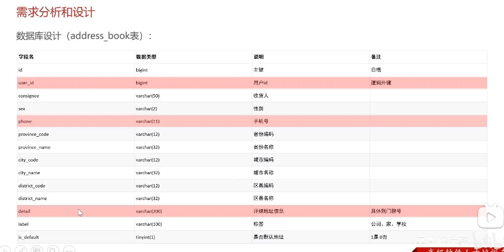
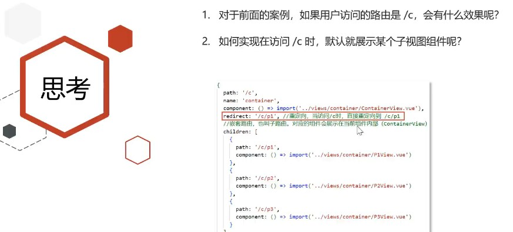
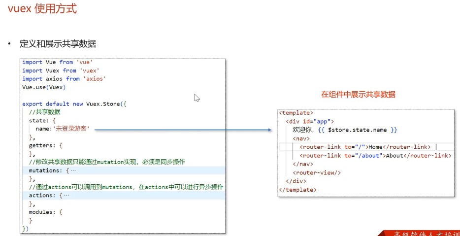
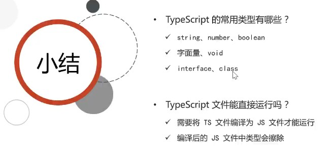

苍穹外卖项目以后端为主，前端仅粗略讲述

# 后端

## 项目整体介绍


## 开发环境搭建

- 后端环境搭建


- 完善登陆功能


## Swagger




1. 导入 knife4j 的maven坐标

```xml
<!--在pom.xml中添加依赖 -->
<dependency>
    <groupId>com.github.xiaoymin</groupId>
    <artifactId>knife4j-spring-boot-starter</artifactId>
</dependency>
```

2. 在配置类中加入 knife4j 相关配置

```java
// WebMvcConfiguration.java

/**
    * 通过knife4j生成接口文档
    * @return
*/
    @Bean
    public Docket docket() {
        ApiInfo apiInfo = new ApiInfoBuilder()
                .title("苍穹外卖项目接口文档")
                .version("2.0")
                .description("苍穹外卖项目接口文档")
                .build();
        Docket docket = new Docket(DocumentationType.SWAGGER_2)
                .apiInfo(apiInfo)
                .select()
                .apis(RequestHandlerSelectors.basePackage("com.sky.controller"))
                .paths(PathSelectors.any())
                .build();
        return docket;
    }
```

3. 设置静态资源映射，否则接口文档页面无法访问

```java
// WebMvcConfiguration.java
/**
    * 设置静态资源映射
    * @param registry
*/
protected void addResourceHandlers(ResourceHandlerRegistry registry) {
        registry.addResourceHandler("/doc.html").addResourceLocations("classpath:/META-INF/resources/");
        registry.addResourceHandler("/webjars/**").addResourceLocations("classpath:/META-INF/resources/webjars/");
}
```




## 员工管理、分类管理

- 新增员工


- 员工分页查询


日期显示存在问题


- 启用禁用员工账号


- 编辑员工


- 分类管理模块

基本同员工管理模块


## 菜品管理

- 公共字段填充


- 新增菜品


- 菜品分页查询


- 删除菜品


- 修改菜品


## 套餐管理

同菜品管理，包含新增套餐、套餐分页查询、删除套餐、修改套餐和起售停售套餐五大业务，自己实现

## 店铺营业状态设置

- Redis入门


- Redis数据类型


- Redis常用命令

1. 字符串操作命令


2. 哈希操作命令


3. 列表操作命令


4. 集合操作命令


5. 有序集合操作命令


6. 通用命令


- 在Java中操作Redis


- 店铺营业状态设置


## 微信登录、商品浏览

- Http Client


```java
// 使用案例
public void testGET() throws Exception{
    //1.创建httpclient对象
    CloseableHttpClient httpClient = HttpClients.createDefault();
    
    //2.创建请求对象
    HttpGet httpGet = new HttpGet("http://localhost:8080/user/shop/status");

    //3.发送请求，接受响应结果
    CloseableHttpResponse response = httpClient.execute(httpGet);

    //4.获取服务端返回的状态码
    int statusCode = response.getStatusLine().getStatusCode();
    System.out.println("服务端返回的状态码为：" + statusCode);

    HttpEntity entity = response.getEntity();
    String body = EntityUtils.toString(entity);
    System.out.println("服务端返回的数据为：" + body);

    //5.关闭资源
    response.close();
    httpClient.close();
}

public void testPOST() throws Exception{
    //1.创建httpclient对象
    CloseableHttpClient httpClient = HttpClients.createDefault();

    //2.创建请求对象
    HttpPost httpPost = new HttpPost("http://localhost:8080/admin/employee/login");
    //2.1设置请求体
    JSONObject jsonObject = new JSONObject();
    jsonObject.put("username","admin");
    jsonObject.put("password","123456");

    StringEntity entity = new StringEntity(jsonObject.toString());
    //2.2指定请求编码方式
    entity.setContentEncoding("utf-8");
    //2.3数据格式
    entity.setContentType("application/json");
    httpPost.setEntity(entity);

    //3.发送请求
    CloseableHttpResponse response = httpClient.execute(httpPost);

    //4.解析返回结果
    int statusCode = response.getStatusLine().getStatusCode();
    System.out.println("响应码为：" + statusCode);
    HttpEntity entity1 = response.getEntity();
    String body = EntityUtils.toString(entity1);
    System.out.println("响应数据为：" + body);

    //5.关闭资源
    response.close();
    httpClient.close();
}
```

- 微信小程序开发


- 微信登录


[微信登录官方说明文档](https://developers.weixin.qq.com/miniprogram/dev/framework/open-ability/login.html)

**步骤分析：**

1. 小程序端，调用wx.login()获取code，就是授权码。
2. 小程序端，调用wx.request()发送请求并携带code，请求开发者服务器(自己编写的后端服务)。
3. 开发者服务端，通过HttpClient向微信接口服务发送请求，并携带appId+appsecret+code三个参数。
4. 开发者服务端，接收微信接口服务返回的数据，session_key+opendId等。opendId是微信用户的唯一标识。
5. 开发者服务端，自定义登录态，生成令牌(token)和openid等数据返回给小程序端，方便后绪请求身份校验。
6. 小程序端，收到自定义登录态，存储storage。
7. 小程序端，后绪通过wx.request()发起业务请求时，携带token。
8. 开发者服务端，收到请求后，通过携带的token，解析当前登录用户的id。
9. 开发者服务端，身份校验通过后，继续相关的业务逻辑处理，最终返回业务数据。


- 导入商品浏览功能代码


## 缓存和购物车

- 缓存菜品


- 缓存套餐

使用Spring Cache缓存框架可以简化操作


- 添加购物车


没有取消冗余字段是为了提高速度，否则添加购物车的时候还需要去查菜品表或套餐表来获取名称、单价等信息

- 查看购物车


- 清空购物车


## 用户下单、订单支付

- 导入地址薄功能代码（就是单表的增删改查）




- 用户下单


- 订单支付

了解微信支付的流程即可，因为需要正规的企业运营执照才能注册微信支付的商户号，进而开通支付权限


需要注册微信支付的商户号才能下载证书和私钥文件


就是为了获取一个临时的公网IP


导入代码后修改 `OrderController` 中的 `payment` 方法，在调用 `OrderService` 的 `payment` 方法时跳过调用微信的订单支付接口，然后直接在`OrderController` 中的 `payment` 方法中继续调用 `OrderService` 的 `paySuccess` 方法完成微信支付进行模拟

## 用户端历史订单模块和商家端订单管理模块

这两个模块为作业

用户端历史订单模块：
- 查询历史订单
- 查询订单详情
- 取消订单
- 再来一单

商家端订单管理模块：
- 订单搜索
- 各个状态的订单数量统计
- 查询订单详情
- 接单
- 拒单
- 取消订单
- 派送订单
- 完成订单

## 订单状态定时处理、来单提醒和客户催单

- 订单状态定时处理


- 来单提醒 


- 客户催单


## 数据统计、图形报表

- Apache ECharts


- 营业额统计


- 用户统计


- 订单统计


- 销量排名Top10


## 数据统计-Excel报表

- 工作台


- Apache POI


- 导出运营数据Excel报表


# 前端

## 基于脚手架创建前端工程


## vue基本使用方式

- 基本语法


- axios


## 路由 Vue-Router


- 路由配置


- 嵌套路由




## 状态管理 Vuex





## TypeScript介绍




## 苍穹外卖前端项目环境搭建

技术选型：
- node.js：基础环境（类似开发java程序需要jdk）
- vue：前端框架
- ElementUI：组件库（表格、菜单、下拉框...）
- axios：前后端交互需要发送ajax异步请求
- vuex ：状态管理，实现多个组件之间的数据共享
- vue-router：路由管理，实现页面跳转
- typeScript：编写代码


## 员工管理

- 员工列表查询


- 启用禁用员工账号


- 新增员工


- 修改员工


