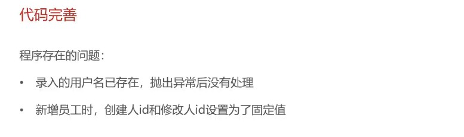

## 项目整体介绍


## 开发环境搭建

- 后端环境搭建


- 完善登陆功能


## Swagger


1. 导入 knife4j 的maven坐标

```xml
<!--在pom.xml中添加依赖 -->
<dependency>
    <groupId>com.github.xiaoymin</groupId>
    <artifactId>knife4j-spring-boot-starter</artifactId>
</dependency>
```

2. 在配置类中加入 knife4j 相关配置

```java
// WebMvcConfiguration.java

/**
    * 通过knife4j生成接口文档
    * @return
*/
    @Bean
    public Docket docket() {
        ApiInfo apiInfo = new ApiInfoBuilder()
                .title("苍穹外卖项目接口文档")
                .version("2.0")
                .description("苍穹外卖项目接口文档")
                .build();
        Docket docket = new Docket(DocumentationType.SWAGGER_2)
                .apiInfo(apiInfo)
                .select()
                .apis(RequestHandlerSelectors.basePackage("com.sky.controller"))
                .paths(PathSelectors.any())
                .build();
        return docket;
    }
```

3. 设置静态资源映射，否则接口文档页面无法访问

```java
// WebMvcConfiguration.java
/**
    * 设置静态资源映射
    * @param registry
*/
protected void addResourceHandlers(ResourceHandlerRegistry registry) {
        registry.addResourceHandler("/doc.html").addResourceLocations("classpath:/META-INF/resources/");
        registry.addResourceHandler("/webjars/**").addResourceLocations("classpath:/META-INF/resources/webjars/");
}
```


## 员工管理、分类管理

- 新增员工





- 员工分页查询


日期显示存在问题


- 启用禁用员工账号


- 编辑员工


- 分类管理模块

基本同员工管理模块


## 菜品管理

- 公共字段填充


- 新增菜品


- 菜品分页查询


- 删除菜品


- 修改菜品


## 套餐管理

同菜品管理，包含新增套餐、套餐分页查询、删除套餐、修改套餐和起售停售套餐五大业务，自己实现

## 店铺营业状态设置

- Redis入门


- Redis数据类型


- Redis常用命令

1. 字符串操作命令


2. 哈希操作命令


3. 列表操作命令


4. 集合操作命令


5. 有序集合操作命令


6. 通用命令


- 在Java中操作Redis


- 店铺营业状态设置


## 微信登录、商品浏览

- Http Client


```java
// 使用案例
public void testGET() throws Exception{
    //1.创建httpclient对象
    CloseableHttpClient httpClient = HttpClients.createDefault();
    
    //2.创建请求对象
    HttpGet httpGet = new HttpGet("http://localhost:8080/user/shop/status");

    //3.发送请求，接受响应结果
    CloseableHttpResponse response = httpClient.execute(httpGet);

    //4.获取服务端返回的状态码
    int statusCode = response.getStatusLine().getStatusCode();
    System.out.println("服务端返回的状态码为：" + statusCode);

    HttpEntity entity = response.getEntity();
    String body = EntityUtils.toString(entity);
    System.out.println("服务端返回的数据为：" + body);

    //5.关闭资源
    response.close();
    httpClient.close();
}

public void testPOST() throws Exception{
    //1.创建httpclient对象
    CloseableHttpClient httpClient = HttpClients.createDefault();

    //2.创建请求对象
    HttpPost httpPost = new HttpPost("http://localhost:8080/admin/employee/login");
    //2.1设置请求体
    JSONObject jsonObject = new JSONObject();
    jsonObject.put("username","admin");
    jsonObject.put("password","123456");

    StringEntity entity = new StringEntity(jsonObject.toString());
    //2.2指定请求编码方式
    entity.setContentEncoding("utf-8");
    //2.3数据格式
    entity.setContentType("application/json");
    httpPost.setEntity(entity);

    //3.发送请求
    CloseableHttpResponse response = httpClient.execute(httpPost);

    //4.解析返回结果
    int statusCode = response.getStatusLine().getStatusCode();
    System.out.println("响应码为：" + statusCode);
    HttpEntity entity1 = response.getEntity();
    String body = EntityUtils.toString(entity1);
    System.out.println("响应数据为：" + body);

    //5.关闭资源
    response.close();
    httpClient.close();
}
```

- 微信小程序开发


- 微信登录


[微信登录官方说明文档](https://developers.weixin.qq.com/miniprogram/dev/framework/open-ability/login.html)

**步骤分析：**

1. 小程序端，调用wx.login()获取code，就是授权码。
2. 小程序端，调用wx.request()发送请求并携带code，请求开发者服务器(自己编写的后端服务)。
3. 开发者服务端，通过HttpClient向微信接口服务发送请求，并携带appId+appsecret+code三个参数。
4. 开发者服务端，接收微信接口服务返回的数据，session_key+opendId等。opendId是微信用户的唯一标识。
5. 开发者服务端，自定义登录态，生成令牌(token)和openid等数据返回给小程序端，方便后绪请求身份校验。
6. 小程序端，收到自定义登录态，存储storage。
7. 小程序端，后绪通过wx.request()发起业务请求时，携带token。
8. 开发者服务端，收到请求后，通过携带的token，解析当前登录用户的id。
9. 开发者服务端，身份校验通过后，继续相关的业务逻辑处理，最终返回业务数据。


- 导入商品浏览功能代码


## 缓存和购物车

- 缓存菜品


- 缓存套餐

使用Spring Cache缓存框架来简化操作


- 添加购物车

- 查看购物车

- 清空购物车
