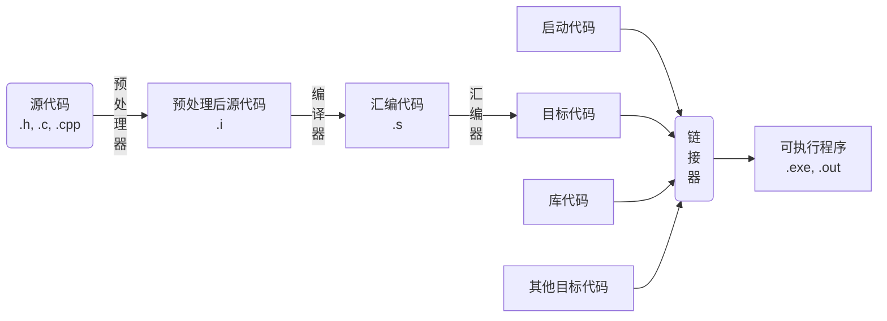

- [lesson01-03 GCC编译器介绍](#lesson01-03-gcc编译器介绍)
  - [一、GCC 工作流程](#一gcc-工作流程)
  - [二、GCC常用参数选项](#二gcc常用参数选项)
- [lesson04-05 静态库的制作](#lesson04-05-静态库的制作)
  - [一、库的介绍](#一库的介绍)
  - [二、静态库的制作](#二静态库的制作)
  - [三、静态库的使用](#三静态库的使用)
- [lesson06-08 动态库的制作和使用](#lesson06-08-动态库的制作和使用)
  - [一、动态库的制作](#一动态库的制作)
  - [二、动态库的使用](#二动态库的使用)
  - [三、解决动态库加载失败问题](#三解决动态库加载失败问题)
    - [方法一、环境变量 LD\_LIBRARY\_PATH](#方法一环境变量-ld_library_path)
      - [1、终端加入到环境变量 LD\_LIBRARY\_PATH 中](#1终端加入到环境变量-ld_library_path-中)
      - [2、永久配置（分为用户级别的配置和系统级别的配置）](#2永久配置分为用户级别的配置和系统级别的配置)
    - [方法二、/etc/ld.so.cache文件列表](#方法二etcldsocache文件列表)
    - [方法三、/lib/，/usr/lib目录](#方法三libusrlib目录)
- [lesson09：静态库和动态库的对比](#lesson09静态库和动态库的对比)
  - [一、程序编译成可执行程序的过程](#一程序编译成可执行程序的过程)
  - [二、静态库制作过程](#二静态库制作过程)
  - [三、动态库制作过程](#三动态库制作过程)
  - [四、静态库、动态库的优缺点](#四静态库动态库的优缺点)
- [lesson10-12 Makefile](#lesson10-12-makefile)
  - [一、文件命名](#一文件命名)
  - [二、Makefile 规则](#二makefile-规则)
  - [三、工作原理](#三工作原理)
  - [四、变量](#四变量)
  - [五、模式匹配](#五模式匹配)
  - [六、函数](#六函数)
- [lesson13-16 GDB调试](#lesson13-16-gdb调试)
  - [GDB 常用命令](#gdb-常用命令)
- [lesson17-30 文件IO](#lesson17-30-文件io)
  - [一、标准 C 库 IO 和 Linux 系统 IO 的关系](#一标准-c-库-io-和-linux-系统-io-的关系)
  - [二、虚拟地址空间](#二虚拟地址空间)
  - [三、文件描述符](#三文件描述符)
  - [四、Linux 系统 IO 函数](#四linux-系统-io-函数)
  - [五、文件属性操作函数](#五文件属性操作函数)
  - [六、目录操作函数](#六目录操作函数)
  - [七、目录遍历函数](#七目录遍历函数)
  - [八、dup、dup2、fcntl 函数](#八dupdup2fcntl-函数)

# lesson01-03 GCC编译器介绍
GCC 原名为 GNU C语言编译器（GNU C Compiler）
安装命令 `sudo apt install gcc g++`
查看版本 `gcc/g++ -v/--version`


## 一、GCC 工作流程


```c++
代码的处理流程以及gcc编译选项
1、源代码 (.h, .c, .cpp) 经过 预处理器 转化为 预处理后的代码 (.i)。 包括头文件的替换，宏处理，注释的删除
    -E      :   g++ test.cpp -E -o test.i
2、预处理后的代码 经过 编译器 转化为 汇编代码 (.s)
    -S      :   g++ test.i -S -o test.s
3、汇编代码 经过 汇编器 转化为 目标代码 (011...)
    -c      :   g++ test.s -s -o test.o   test.o文件就可以直接执行了
4、目标代码跟其他代码（包括启动代码、库代码、其他目标代码）经过 链接器 转化为 可执行文件 (.exe .out)
    -o [file1] [file2] / [file2] - 0 [file1] ，指将file2编译成可执行文件file1

若直接-S会包含两个操作，生成test.s文件
```

## 二、GCC常用参数选项

|       gcc编译选项     |       说明        |
|       :--:            |       :--:        |
| `-E` | 预处理指定的源文件，不进行编译 |
| `-S` | 编译指定的源文件，但是不进行汇编 |
| `-c` | 编译、汇编指定的源文件，但是不进行链接 |
| `-o [file1] [file2] / [file2] -o [file1]` | 将文件 file2 编译成可执行文件 file1 |
| `-I directory` | 指定 include 包含文件的搜索目录 |
| `-g` | 在编译的时候，生成调试信息，该程序可以被调试器调试 |
| `-D` | 在程序编译的时候，指定一个宏 |
| `-w` | 不生成任何警告信息 | 
| `-Wall` | 生成所有警告信息 |
| `-On` | n的取值范围：0~3。编译器的优化选项的4个级别，-O0表示没有优化，-O1为缺省值，-O3优化级别最高 |
| `-l` | 在程序编译的时候，指定使用的库 | 
| `-L` | 指定编译的时候，搜索的库的路径 |
| `-fPIC / fpic` | 生成与位置无关的代码 |
| `-shared` | 生成共享目标文件，通常用在建立共享库时 |

`-D`指定宏 (`g++ test.cpp -o test_app2 -D DEBUG`) 相当于在程序内部增加了一行  `#define DEBUG`

# lesson04-05 静态库的制作

## 一、库的介绍

库文件是计算机上的一类文件，可以简单的把库文件看成一种代码仓库，它提供给使用者一些可以直接拿来用的变量、函数或类

库文件有两种，静态库和动态库（共享库），区别是：静态库在程序的链接阶段被复制到了程序中；动态库在链接阶段没有被复制到程序中，而是程序在运行时由系统动态加载到内存中供程序调用。

库的好处
1. 代码保密 
2. 方便部署和分发

## 二、静态库的制作

```c++
静态库
    命名规则：
        1、Linux ：libXXX.a
            lib: 前缀（固定）
            XXX: 库的名字，自定义
            .a： 后缀（固定）

        2、Windows ：libXXX.lib
    
    制作：
        1、gcc 获得 .o 文件
        2、将 .o 文件打包，使用 ar 工具（archive）
            ar rcs libXXX.a XXX.o XXX.o

                r - 将文件插入备存文件中
                c - 建立备存文件
                s - 索引
```

例子：
```
已有文件（calc），制作计算器的库
    ├── add.c
    ├── div.c
    ├── head.h
    ├── main.c
    ├── mult.c
    └── sub.c

1、g++ -c add.c sub.c mult.c div.c  生成 xx.o 文件

2、ar rcs libcalc.a add.o sub.o mult.o div.o    生成静态库文件 libcalc.a
```

## 三、静态库的使用
```c++
静态库的使用（必须把**库文件和头文件**都给用户），假设有个叫library的项目

1、首先制作静态库，放到lib文件下下

    ├── include
    │   └── head.h
    ├── lib
    │   └── libcalc.a
    ├── main.c
    └── src
        ├── add.c
        ├── div.c
        ├── mult.c
        └── sub.c

2、编译主函数
    gcc main.c -o app   报错（fatal error: head.h: 没有那个文件或目录）。因为head.h是相对于main.c的相对路径，找不到（使用gcc的 -I 指定 include 包含文件的搜索目录）
    gcc main.c -o app -I ./include/     报错（main.c:(.text+0x41): undefined reference to `add',...）。找不到函数的定义，因为在静态库中。（-l 在程序编译的时候，指定使用的库）
    gcc main.c -o app -I ./include/ -l calc     注意加的库的名称calc（报错，找不到calc），需要（-L 指定编译的时候，搜索的库的路径）
    gcc main.c -o app -I ./include/ -l calc -L ./lib/
```

# lesson06-08 动态库的制作和使用
## 一、动态库的制作
```c++
动态库
    命名规则：
        1、Linux ：libxxx.so
            lib: 前缀（固定）
            XXX: 库的名字，自定义
            .so： 后缀（固定）
            在Linux下是一个可执行文件

        2、Windows ：libxxx.dll
    
    制作：
        1、gcc 得到 .o 文件，得到和位置无关的代码
            gcc -c –fpic/-fPIC a.c b.c

        2、gcc 得到动态库
            gcc -shared a.o b.o -o libcalc.so

    使用：
        包含头文件的路径、动态库的路径
        gcc main.c -o main_app -I ./include -L ./lib/ -l calc

        编译可以直接通过，但是直接执行的话（./main_app）会报错
        报错信息：error while loading shared libraries: libcalc.so: cannot open shared object file: No such file or directory
```
## 二、动态库的使用
工作原理：
1. 静态库：GCC 进行链接时，会把静态库中代码打包到可执行程序中
2. 动态库：GCC 进行链接时，动态库的代码不会被打包到可执行程序中
    
注意使用动态库时也必须把**库文件和头文件**都给用户

程序启动之后，动态库会被动态加载到内存中，通过 `ldd` (list dynamic dependencies) 命令检查动态库依赖关系，`ldd main_app` 的结果：
```c++
linux-vdso.so.1 (0x00007ffd50475000)
libcalc.so => not found
libc.so.6 => /lib/x86_64-linux-gnu/libc.so.6 (0x00007fa3f6a00000)
/lib64/ld-linux-x86-64.so.2 (0x00007fa3f6c2d000)
```

如何定位共享库文件呢？

当系统加载可执行代码时候，能够知道其所依赖的库的名字，但是还需要知道绝对路径。此时就需要系统的动态载入器来获取该绝对路径。对于elf格式的可执行程序，是由`ld-linux.so`来完成的，它先后搜索
- elf文件的`DT_RPATH`段
- 环境变量`LD_LIBRARY_PATH`
- `/etc/ld.so.cache`文件列表
- `/lib/`, `/usr/lib`目录

找到库文件后将其载入内存。

## 三、解决动态库加载失败问题

根本原因在于执行可执行代码的时候需要知道其所依赖的库的绝对路径，系统根据动态载入器依次在多个文件夹中查找该动态库的时候，找不到需要的动态库，因此加载失败。

解决办法为将绝对路径加入到文件夹中，让它可以搜索到所需的动态库即可。

### 方法一、环境变量 LD_LIBRARY_PATH 
#### 1、终端加入到环境变量 LD_LIBRARY_PATH 中
查看环境变量：`env`  
可以发现环境变量是键值对的形式，并且一个键可以对应多个值，中间以 : 隔开
```c++
export LD_LIBRARY_PATH=$LD_LIBRARY_PATH:/home/casey/niuke/lesson06/library/lib
// $LD_LIBRARY_PATH指获取当前的值，然后加:把当前动态库的绝对地址拼接到后面

查看某个环境变量：echo $LD_LIBRARY_PATH (:/home/casey/niuke/lesson06/library/lib)，目前只有一个

再 ldd main_app，注意第二行（之前为not found），可以运行了
    linux-vdso.so.1 (0x00007ffe4b1b1000)
    libcalc.so => /home/casey/niuke/lesson06/library/lib/libcalc.so (0x00007f8b86b63000)
    libc.so.6 => /lib/x86_64-linux-gnu/libc.so.6 (0x00007f8b86800000)
    /lib64/ld-linux-x86-64.so.2 (0x00007f8b86b6f000)
```
这种方法为直接在终端中配置（配置的环境变量只是临时的），若关闭当前终端，下次还是无法运行！！

#### 2、永久配置（分为用户级别的配置和系统级别的配置）

用户级别的配置，需要到home目录下的隐藏文件 `.bashrc` 修改信息
```c++
vim .bashrc，到最后一行（shift + g），增加
export LD_LIBRARY_PATH=$LD_LIBRARY_PATH:/home/casey/niuke/lesson06/library/lib
再输入指令（. ~/.bashrc，~表示家目录）让其生效，第一个点相当于source，也可以source ~/.bashrc
```

系统级别的配置，到`etc/profile`文件

```c++
sudo vim /etc/profile，在最后一行增加
export LD_LIBRARY_PATH=$LD_LIBRARY_PATH:/home/casey/niuke/lesson06/library/lib
刷新一下即可
```

### 方法二、/etc/ld.so.cache文件列表

`/etc/ld.so.cache`为二进制文件，难以直接修改，通过其他文件进行间接修改！
```c++
sudo vim /etc/ld.so.conf
只需加入绝对路径即可:/home/casey/niuke/lesson06/library/lib
sudo ldconfig 进行更新
```

### 方法三、/lib/，/usr/lib目录

直接把动态库放到这个目录下就可以，但不推荐使用。因为它们本身包含了很多系统自带的库文件，若自己的动态库文件跟它们重名了可能会把他们覆盖掉

# lesson09：静态库和动态库的对比

## 一、程序编译成可执行程序的过程


静态库、动态库区别来自链接阶段如何处理，链接成可执行程序。分别称为静态链接方式和动态链接方式

## 二、静态库制作过程


## 三、动态库制作过程


## 四、静态库、动态库的优缺点

***静态库的优缺点***
- 优点：
    1. 静态库被打包到应用程序中加载速度快
    2. 发布程序无需提供静态库，移植方便
- 缺点：
    1. 消耗系统资源，浪费内存
    2. 更新、部署、发布麻烦

***动态库的优缺点***
- 优点：
    1. 可以实现进程间资源共享（共享库）
    2. 更新、部署、发布简单
    3. 可以控制何时加载动态库
- 缺点：
    1. 加载速度比静态库慢
    2. 发布程序时需要提供依赖的动态库

一般来说，若库比较小的话使用静态库

# lesson10-12 Makefile

Makefile 文件定义了一系列的规则来指定文件编译的先后顺序，哪些文件需要重新编译，甚至于进行更复杂的功能操作，因为 Makefile 文件就像一个 Shell 脚本一样，也可以执行操作系统的命令。

Makefile 带来的好处就是“自动化编译” ，只需要一个 `make` 命令，整个工程完全自动编译。make 是一个解释 Makefile 文件中指令的命令工具。

## 一、文件命名
makefile 或者 Makefile

## 二、Makefile 规则

一个 Makefile 文件中可以有一个或者多个规则
```shell
目标 ...: 依赖 ...
    命令（Shell 命令）
    ...
```
目标：最终要生成的文件（伪目标除外）
依赖：生成目标所需要的文件或是目标
命令：通过执行命令对依赖操作生成目标（命令前必须 Tab 缩进）
Makefile 中的其它规则一般都是为第一条规则服务的。
    
## 三、工作原理

1. 命令在执行之前，需要先检查规则中的依赖是否存在
    - 如果存在，执行命令
    - 如果不存在，向下检查其它的规则，检查有没有一个规则是用来生成这个依赖的，如果找到了，则执行该规则中的命令
2. 检测更新，在执行规则中的命令时，会比较目标和依赖文件的时间
    - 如果依赖的时间比目标的时间晚，需要重新生成目标
    - 如果依赖的时间比目标的时间早，目标不需要更新，对应规则中的命令不需要被执行

## 四、变量
```c++
// 自定义变量

变量名=变量值 var=hello

// 预定义变量

AR : 归档维护程序的名称，默认值为 ar
CC : C 编译器的名称，默认值为 cc
CXX : C++ 编译器的名称，默认值为 g++
$@ : 目标的完整名称
$< : 第一个依赖文件的名称
$^ : 所有的依赖文件

$(变量名) // 获取变量的值

// 自动变量只能在规则的命令中使用：
app:main.c a.c b.c
    $(CC) -c $^ -o $@
```

## 五、模式匹配
通配符（`%.o:%.c`）
- %: 通配符，匹配一个字符串
- 两个%匹配的是同一个字符串

```shell
// 原来的
    add.o:add.c
        gcc -c add.c
    div.o:div.c
        gcc -c div.c
    ...

// 使用通配符以后：
    %.o:%.c
        gcc -c $< -o $@
```

## 六、函数
```shell
$(wildcard PATTERN...)
    - 功能：获取指定目录下指定类型的文件列表
    - 参数：PATTERN 指的是某个或多个目录下的对应的某种类型的文件，如果有多个目录，一般使用空格间隔
    - 返回：得到的若干个文件的文件列表，文件名之间使用空格间隔

    // 示例
    $(wildcard *.c ./sub/ *.c) // 返回值格式: a.c b.c c.c d.c e.c f.c

$(patsubst <pattern>,<replacement>,<text>)
    - 功能：
        查找<text>中的单词 (单词以“空格”、“Tab”或“回车”“换行”分隔) 是否符合模式<pattern>，如果匹配的话，则以<replacement>替换。<pattern>可以包括通配符`%`，表示任意长度的字串。如果<replacement>中也包含`%`，那么，<replacement>中的这个`%`将是<pattern>中的那个%所代表的字串。(可以用`\`来转义，以`\%`来表示真实含义的`%`字符)
    - 返回：函数返回被替换过后的字符串

    // 示例：
    $(patsubst %.c, %.o, x.c bar.c)
    返回值格式: x.o bar.o
```

实现make后删除 *.o，可以新增一个规则（比如叫 clean），它不需要任何依赖，`objs`即为所有 `*.o`
```shell
clean:
    rm $(objs) -f
```     

注意：直接 make 不会执行 clean 规则，因为默认执行第一个，而clean跟第一个生成可执行文件的规则没有关系

运行clean规则 ：`make clean`

若目录中存在同名文件 (clean)，则执行失败 (提示 make: "clean"已是最新)。因为该规则没有依赖，总是认为依赖比目标早，无需更新
        
解决方法：将clean规则定义为伪目标，即clean上一行加上 `.PHONY:clean`        


# lesson13-16 GDB调试

GDB 是由 GNU 软件系统社区提供的调试工具，同 GCC 配套组成了一套完整的开发环境，GDB 是 Linux 和许多类 Unix 系统中的标准开发环境

一般来说，GDB 主要帮助你完成下面四个方面的功能：
1. 启动程序，可以按照自定义的要求随心所欲的运行程序
2. 可让被调试的程序在所指定的调置的断点处停住（断点可以是条件表达式）
3. 当程序被停住时，可以检查此时程序中所发生的事
4. 可以改变程序，将一个 BUG 产生的影响修正从而测试其他 BUG

通常，在为调试而编译时，会关掉编译器的优化选项 (`-O`)， 并打开调试选项 (`-g`)。另外，`-Wall`在尽量不影响程序行为的情况下选项打开所有warning，也可以发现许多问题，避免一些不必要的 BUG。

```shell
gcc -g -Wall program.c -o program (可以发现生成的可执行文件比不加 -g 的大)
```

`-g` 选项的作用是在可执行文件中加入源代码的信息，比如可执行文件中第几条机器指令对应源代码的第几行，但并不是把整个源文件嵌入到可执行文件中，所以在调试时必须保证 gdb 能找到源文件。

若用gdb 打开非 -g 生成的可执行文件并用 list命令查看代码，会显示错误 (没有符号表被读取)。同理若生成可执行文件后修改了源代码文件的名字同样会报错
## GDB 常用命令
```shell
1、启动、退出、查看代码
    ◼ 启动和退出
        gdb 可执行程序
        quit
    ◼ 给程序设置参数/获取设置参数
        set args 10 20
        show args
    ◼ GDB 使用帮助
        help
    ◼ 查看当前文件代码
        list/l （l 是简写，从默认位置显示，默认显示main.cpp）
        list/l 行号 （从指定的行显示，以该行号为中心显示上下文）
        list/l 函数名（从指定的函数显示）
    ◼ 查看非当前文件代码
        list/l 文件名:行号
        list/l 文件名:函数名
    ◼ 设置显示的行数
        show list/listsize
        set list/listsize 行数

2、断点操作   
    ◼ 设置断点
        b/break 行号
        b/break 函数名
        b/break 文件名:行号
        b/break 文件名:函数
    ◼ 查看断点
        i/info b/break
    ◼ 删除断点
        d/del/delete 断点编号
    ◼ 设置断点无效
        dis/disable 断点编号
    ◼ 设置断点生效
        ena/enable 断点编号
    ◼ 设置条件断点（一般用在循环的位置）
        b/break 10 if i==5

3、调试命令 
    ◼ 运行GDB程序
        start（程序停在第一行）
        run（遇到断点才停）
    ◼ 继续运行，到下一个断点停
        c/continue
    ◼ 向下执行一行代码（不会进入函数体）
        n/next
    ◼ 变量操作
        p/print 变量名（打印变量值）
        ptype 变量名（打印变量类型）
    ◼ 向下单步调试（遇到函数进入函数体）
        s/step
        finish（跳出函数体，注意函数体内部不能有断点，否则会运行到端点处而不是直接跳出循环）
    ◼ 自动变量操作
        display 变量名（自动打印指定变量的值）
        i/info display
        undisplay 编号
    ◼ 其它操作
        set var 变量名=变量值 (循环中用的较多，比如当前i为2，可以改变i的值让它一直运行，直到设置的值 (set var i = 9)
        until （跳出循环，需满足条件当前执行到了循环的最后一行（即第一行）并且循环内部没有断点）
```

# lesson17-30 文件IO

站在内存的角度看IO，即O是把内存中的数据写到文件

## 一、标准 C 库 IO 和 Linux 系统 IO 的关系

**标准 C 库 IO 函数 (带缓冲区)**

标准 C 库的 IO 函数跨平台，若是 Windows / Linux 系统，它会调用 Windows / Linux的接口。它先写到缓冲区中，带满足条件时（如刷新缓冲区：fflush；缓冲区已满；正常关闭文件）一次读写，效率更高。


**Linux 系统 IO 函数**
Linux 系统的 IO 无缓冲区，直接写到文件中，效率相比于 C 的低，但是在网络通信这些实时性要求高的应用中就得用 Linux 的 IO；单纯的读写文件则 C 库的 IO 更合适
 
**标准C库和Linux系统IO的关系**


## 二、虚拟地址空间

可执行程序执行期间 (即一个进程) 就会对应一个虚拟地址空间。32 位的 CPU 虚拟地址空间大小就是 2^32, 4G; 64位的是 2^48。以32位的为例，分为两块区域 (0 - 3G: 用户区, 3 - 4G: 内核区域)。

虚拟地址空间最后会被 CPU 中的内存管理单元 MMU 映射到真实的物理内存上


## 三、文件描述符

由内核区的进程控制块 PCB 管理，PCB 里有一个文件描述符表 (数组)
数组前三个已被占用, 默认是打开状态, 跟终端文件绑定 (`/dev/tty`)
- 0: 标准输入 (`STDIN_FILENO`)
- 1: 标准输出 (`STDOUT_FILENO`)
- 3: 标准错误 (`STDERR_FILENO`)

多次打开同一个文件返回的文件描述符是不一样的，关闭文件后释放该文件描述符


## 四、Linux 系统 IO 函数

```c++
//打开一个已经存在的文件
int open(const char *pathname, int flags); // sys/types.h, sys/stat.h, fcntl.h
    - flags: 对文件的操作权限设置还有其他设置
        - O_RDONLY, O_WRONLY, O_RDWR (操作权限，必选项且这三个参数是互斥的)
        - O_APPEND, O_CREAT, ... (可选)
    返回值: 返回一个新的文件描述符；如果调用失败，返回 -1 (设置errno)
    errno: 属于Linux 系统函数库，库里面的一个全局变量，记录的是最近的错误号

    // 打印错误具体信息:
    void perror(const char *s); //打印 errno 对应的错误描述，在 stdio.h 里
        s参数: 用户描述, 比如hello, 最终输出结果: hello:XXX (实际的错误描述)

//创建一个新的文件
int open(const char *pathname, int flags, mode_t mode);
    - flags: 对文件的操作权限设置还有其他设置
        - 必选项: O_RDONLY, O_WRONLY, O_RDWR (互斥的)
        - 可选项: O_CREAT 文件不存在，创建新文件
    - mode: 八进制的数，表示创建出的新文件的操作权限，比如 0775 (0开头, 八进制)
        三组权限分别指文件所有者，跟文件所有者同组用户，其他组用户的读写执行权限
        实际文件的操作权限为: mode & ~umask
    
int close(int fd); // 在 unistd.h 里

ssize_t read(int fd, void *buf, size_t count); // 在 unistd.h 里
    从文件中读取数据到内存
    参数: 
        - fd: 文件描述符
        - buf: 需要读取数据存放的地方，数组的地址（传出参数）
        - count: 指定的数组的大小
    返回值: 
        - 成功: 
            >0: 返回实际的读取到的字节数
            =0: 文件已经读取完了
        - 失败: -1 ，并且设置errno

ssize_t write(int fd, const void *buf, size_t count); // 在 unistd.h 里
    参数: 
        - fd: 文件描述符
        - buf: 要往磁盘写入的数据，数据
        - count: 要写的数据的实际的大小
    返回值: 
        成功: 实际写入的字节数
        失败: 返回-1，并设置errno
```

***案例：用 read, write 实现拷贝文件的操作***

```c++
#include <unistd.h>
#include <stdio.h>
#include <sys/types.h>
#include <sys/stat.h>
#include <fcntl.h>

int main() {
    // 1.通过open打开a.txt文件
    int srcfd = open("a.txt", O_RDONLY);
    if(srcfd == -1) {
        perror("open");
        return -1;
    }
    // 2.创建一个新的文件（拷贝文件）
    int destfd = open("b.txt", O_WRONLY | O_CREAT, 0664);
    if(destfd == -1) {
        perror("open");
        return -1;
    }
    // 3.频繁的读写操作
    char buf[1024] = {0};
    int len = 0;
    while((len = read(srcfd, buf, sizeof(buf))) > 0)
        write(destfd, buf, len);
    // 4.关闭文件
    close(destfd), close(srcfd);
    return 0;
}
```

其它Linux系统IO函数

```c++
// 设置文件指针的偏移量
off_t lseek(int fd, off_t offset, int whence);
    参数: 
        - offset: 偏移量
        - whence: 
            SEEK_SET: 设置偏移量为 offset 的值
            SEEK_CUR: 设置偏移量 当前位置 + 第二个参数 offset 的值
            SEEK_END: 设置偏移量 文件大小 + 第二个参数 offset 的值
    返回值:
        返回文件指针的位置
    作用: 
        1. 移动文件指针到头文件 lseek(fd, 0, SEEK_SET);
        2. 获取当前文件指针的位置 lseek(fd, 0, SEEK_CUR);
        3. 获取文件长度 lseek(fd, 0, SEEK_END);
        4. 扩展文件的长度，当前文件10b, 增加100个字节 lseek(fd, 100, SEEK_END);
            注意需要写一次数据才能看出来

// 获取一个文件相关的一些信息
int stat(const char *pathname, struct stat *statbuf);
    参数:
        - pathname：操作的文件的路径
        - statbuf：结构体变量，传出参数，用于保存获取到的文件的信息
    返回值：
        成功：返回0
        失败：返回-1 设置errno

// 获取软链接文件信息
int lstat(const char *pathname, struct stat *statbuf);
    参数:
        - pathname：操作的文件的路径
        - statbuf：结构体变量，传出参数，用于保存获取到的文件的信息
    返回值：
        成功：返回0
        失败：返回-1 设置errno
    用处：
        假设 b.txt 是 a.txt 的一个软连接，那么用 stat() 获取 b.txt 的信息的结果实际上是 a.txt 的结果
        若要获取软连接 b.txt 的信息就要用 lstat()

// stat 结构体
struct stat {
    dev_t st_dev; // 文件的设备编号
    ino_t st_ino; // 节点
    mode_t st_mode; // 文件的类型和存取的权限
    nlink_t st_nlink; // 连到该文件的硬连接数目
    uid_t st_uid; // 用户ID
    gid_t st_gid; // 组ID
    dev_t st_rdev; // 设备文件的设备编号
    off_t st_size; // 文件字节数(文件大小)
    blksize_t st_blksize; // 块大小
    blkcnt_t st_blocks; // 块数
    time_t st_atime; // 最后一次访问时间
    time_t st_mtime; // 最后一次修改时间
    time_t st_ctime; // 最后一次改变时间(指属性)
};
```

***用 stat() 实现 ls-l***

输出信息：`-rw-rw-r-- 1 nowcoder nowcoder 12 12月 3 15:48 a.txt`
```c++
#include <stdio.h>
#include <sys/types.h>
#include <sys/stat.h>
#include <unistd.h>
#include <pwd.h>
#include <grp.h>
#include <time.h>
#include <string.h>

int main(int argc, char * argv[]) {
    if(argc < 2) { // 判断输入的参数是否正确
        printf("%s filename\n", argv[0]);
        return -1;
    }
    // 通过stat函数获取用户传入的文件的信息
    struct stat st;
    int ret = stat(argv[1], &st);
    if(ret == -1) {
        perror("stat");
        return -1;
    }
    // 获取文件类型和文件权限
    char perms[11] = {0};   // 用于保存文件类型和文件权限的字符串
    switch(st.st_mode & S_IFMT) {
        case S_IFLNK:
            perms[0] = 'l';
            break;
        case S_IFDIR:
            perms[0] = 'd';
            break;
        case S_IFREG:
            perms[0] = '-';
            break; 
        case S_IFBLK:
            perms[0] = 'b';
            break; 
        case S_IFCHR:
            perms[0] = 'c';
            break; 
        case S_IFSOCK:
            perms[0] = 's';
            break;
        case S_IFIFO:
            perms[0] = 'p';
            break;
        default:
            perms[0] = '?';
            break;
    }
    // 判断文件的访问权限
    // 文件所有者
    perms[1] = (st.st_mode & S_IRUSR) ? 'r' : '-';
    perms[2] = (st.st_mode & S_IWUSR) ? 'w' : '-';
    perms[3] = (st.st_mode & S_IXUSR) ? 'x' : '-';
    // 文件所在组
    perms[4] = (st.st_mode & S_IRGRP) ? 'r' : '-';
    perms[5] = (st.st_mode & S_IWGRP) ? 'w' : '-';
    perms[6] = (st.st_mode & S_IXGRP) ? 'x' : '-';
    // 其他人
    perms[7] = (st.st_mode & S_IROTH) ? 'r' : '-';
    perms[8] = (st.st_mode & S_IWOTH) ? 'w' : '-';
    perms[9] = (st.st_mode & S_IXOTH) ? 'x' : '-';
    // 硬连接数
    int linkNum = st.st_nlink;
    // 文件所有者
    char * fileUser = getpwuid(st.st_uid)->pw_name;
    // 文件所在组
    char * fileGrp = getgrgid(st.st_gid)->gr_name;
    // 文件大小
    long int fileSize = st.st_size;
    // 获取修改的时间
    char * time = ctime(&st.st_mtime);
    char mtime[512] = {0};
    strncpy(mtime, time, strlen(time) - 1);
    char buf[1024];
    sprintf(buf, "%s %d %s %s %ld %s %s", perms, linkNum, fileUser, fileGrp, fileSize, mtime, argv[1]);
    printf("%s\n", buf);
    return 0;
}
```

## 五、文件属性操作函数

```c++
// 判断某个文件是否有某个权限，或者判断文件是否存在
int access(const char *pathname, int mode); // 在 unistd.h 中
    参数: 
        - pathname: 判断的文件路径
        - mode:
            R_OK: 判断是否有读权限
            W_OK: 判断是否有写权限
            X_OK: 判断是否有执行权限
            F_OK: 判断文件是否存在
    返回值: 成功返回0， 失败返回-1

// 修改文件的权限
int chmod(const char *pathname, mode_t mode); // 在 sys/stat.h 中
    参数: 
        - pathname: 需要修改的文件的路径
        - mode: 需要修改的权限值，八进制的数 (也可以直接用已有的宏, 如S_IRUSR, S_IWUSR, S_IXUSR, ...)
    返回值: 成功返回0，失败返回-1

// 用于修改文件的所有者
int chown(const char *pathname, uid_t owner, gid_t group); // 在 unistd.h 中
    参数: 
        - owner: 所有者的id
        - group: 所在组的组id

// 缩减或者扩展文件的尺寸至指定的大小
int truncate(const char *path, off_t length); // 在 unistd.h, sys/types.h 中
    参数: 
        - path: 需要修改的文件的路径
        - length: 需要最终文件变成的大小
    返回值：
        成功返回0， 失败返回-1
```

## 六、目录操作函数

```c++
// 创建一个目录
int mkdir(const char *pathname, mode_t mode); // 在 sys/stat.h, sys/types.h 中
    参数：
        pathname: 创建的目录的路径
        mode: 权限，八进制的数，注意umask (一个目录必须有可执行权限才能进入当前目录)
    返回值：
        成功返回0， 失败返回-1

// 删除目录，注意只能删除空目录，若目录非空必须先删除目录里面的文件
int rmdir(const char *pathname);

int rename(const char *oldpath, const char *newpath); //stdio.h

// 修改进程的工作目录
int chdir(const char *path); //unistd.h
    比如在/home/nowcoder 启动了一个可执行程序a.out, 进程的工作目录 /home/casey
    参数：
        path : 需要修改的工作目录
    返回值：-1失败

// 获取当前工作目录
char *getcwd(char *buf, size_t size); //unistd.h
    参数：
        - buf : 存储的路径，指向的是一个数组（传出参数）
        - size: 数组的大小
    返回值：
        返回的指向的一块内存，这个数据就是第一个参数
```

## 七、目录遍历函数

```c++
// 打开一个目录
DIR *opendir(const char *name); //sys/types.h, dirent.h
    参数：
        - name: 需要打开的目录的名称
    返回值：
        DIR * 类型，理解为目录流
        错误返回NULL

// 读取目录中的数据
struct dirent *readdir(DIR *dirp); //dirent.h
    参数：dirp是opendir返回的结果
    返回值：
        struct dirent，代表读取到的文件的信息
        struct dirent
        {           
            ino_t d_ino; // 此目录进入点的inode
            off_t d_off; // 目录文件开头至此目录进入点的位移
            unsigned short int d_reclen; // d_name 的长度, 不包含NULL字符
            unsigned char d_type; // d_name 所指的文件类型
            char d_name[256]; // 文件名
        };

        d_type包含
            1) DT_BLK - 块设备; 2) DT_CHR - 字符设备; 3) DT_DIR - 目录; 
            4) DT_LNK - 软连接; 5) DT_FIFO - 管道; 6) DT_REG - 普通文件; 
            7) DT_SOCK - 套接字; 8) DT_UNKNOWN - 未知
        
        读取到了末尾或者失败了，返回NULL

// 关闭目录
int closedir(DIR *dirp); //sys/types.h, dirent.h
```

***案例: 读取某个目录下所有普通文件的数目，若目录里有子目录，需要进入子目录***

```c++
#include <sys/types.h>
#include <dirent.h>
#include <stdio.h>
#include <string.h>
#include <stdlib.h>
#include <errno.h>

int main(int argc, char * argv[]) {
    if(argc < 2) {
        printf("%s path\n", argv[0]);
        return -1;
    }
    int num = getFileNum(argv[1]);
    printf("普通文件的个数为：%d\n", num);
    return 0;
}

// 用于获取目录下所有普通文件的个数
int getFileNum(const char * path) {
    DIR * dir = opendir(path); // 1.打开目录
    if(dir == NULL) {
        perror("opendir");
        exit(0);
    }
    struct dirent *ptr;
    int total = 0; // 记录普通文件的个数
    while((ptr = readdir(dir)) != NULL) {
        char * dname = ptr->d_name; // 获取名称
        // 忽略掉. 和..
        if(strcmp(dname, ".") == 0 || strcmp(dname, "..") == 0) continue;
        // 判断是否是普通文件还是目录
        if(ptr->d_type == DT_DIR) { // 目录,需要继续读取这个目录
            char newpath[256];
            sprintf(newpath, "%s/%s", path, dname);
            total += getFileNum(newpath);
        }
        if(ptr->d_type == DT_REG) total++; // 普通文件
    }
    closedir(dir); // 关闭目录
    return total;
}
```
## 八、dup、dup2、fcntl 函数

```c++
// 复制一个新的文件描述符，它们指向同一个文件
int dup(int oldfd); //unistd.h
    参数：
        oldfd 文件描述符
    返回值：
        成功则从空闲的文件描述符表中找一个最小的，作为新的拷贝的文件描述符，失败返回-1
    例子：
        int fd = 3; //fd 指向 a.txt
        int fd1 = dup(fd); //fd1也是指向a.txt
        若关闭了fd，fd1仍能向 a.txt 中写数据
    
// 重定向文件描述符，不同于 dup() 找一个空闲的最小的文件描述符，dup2() 由我们自己指定
// 若 newfd 为一个已经打开的指向其他文件的文件描述符，则会先关闭那个文件，再指向 oldfd 指向的文件
int dup2(int oldfd, int newfd); //unistd.h
    参数：
        oldfd, newfd 文件描述符
    返回值：
        失败返回-1

int fcntl(int fd, int cmd, ...); //unistd.h, fcntl.h
参数：
    fd : 表示需要操作的文件描述符
    cmd: 表示对文件描述符进行如何操作
        - F_DUPFD : 
            复制文件描述符,复制的是第一个参数fd，得到一个新的文件描述符（返回值）
            int ret = fcntl(fd, F_DUPFD);
            同 dup()，从空闲的文件描述符表中找一个最小的

        - F_GETFL : 
            获取指定的文件描述符文件状态flag
            获取的flag和我们通过open函数传递的flag是一个东西 (O_RDONLY, O_WRONLY,...)

        - F_SETFL : 
            设置文件描述符文件状态flag
            必选项：O_RDONLY, O_WRONLY, O_RDWR 不可以被修改
            可选性：O_APPEND, O_NONBLOCK
                O_APPEND 表示追加数据
                NONBLOK 设置成非阻塞
        
        阻塞和非阻塞：描述的是函数调用的行为。
```